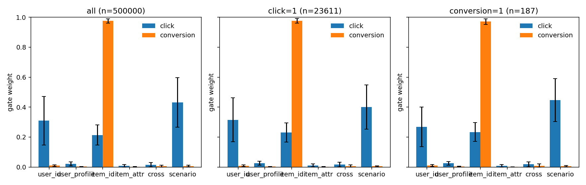
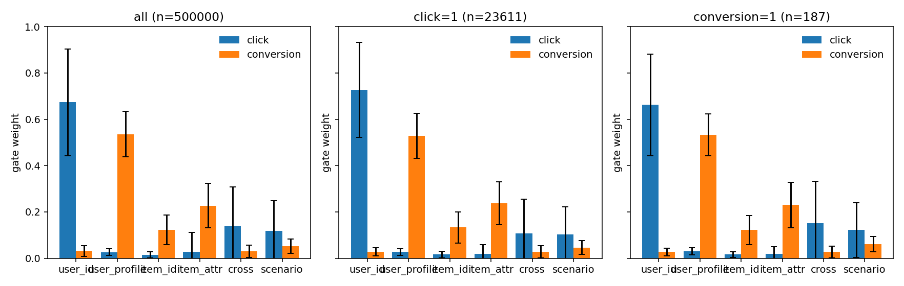
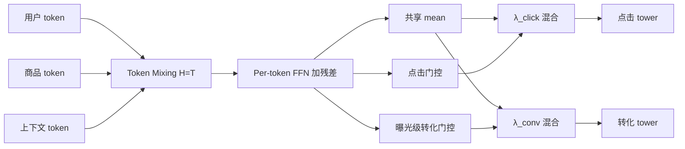

# 本 Fork 的贡献：一次诊断，不是一个打赢基线的模型

这是我在 FuxiCTR 上做的诊断。骨干是字节跳动 RankMixer（Zhu 等，CIKM 2025）的复现。我加上的是 **MT-RankMixer**：每个任务自己的 token 门控，以及残差池化

\[
h_k = \lambda_k \,\mathrm{mean}_t(x_t) + (1-\lambda_k)\sum_t \alpha_{k,t} x_t.
\]

三个指标分开写。**click AUC** 是点击。**曝光级转化 AUC** 是整条曝光上的联合转化。**clicked-only CVR AUC** 只在 `click=1` 的行上、用转化头排序。`p_conv/p_click` 是同一批点击行上的另一种排序，不是曝光级转化。

协议是：训练和选择只看验证集；test 在设计冻结之后读一次。验证集研究（35 次，exit 0）没有读 test。后续实验在同一批 checkpoint 上补了 PLE 调参、固定损失权重 `W[1,10]`、clicked-only CVR，然后对预注册的 55 个 checkpoint 读了一次 test（`FINAL_TEST_DONE` 挡住第二次）。全部任务 exit 0。原始表在 `benchmarks/rankmixer/results/followup/followup_results.md`。

**结论。** 把 PLE 的学习率在验证集上调到 5e-4 之后，它的 5 种子验证集平均 AUC 是 0.62959 ± 0.00188，和最好的 MT-RankMixer 变体打平。我先前写的「RankMixer 变体高于 PLE」针对的是没有调过的 PLE（验证集平均 AUC 0.62480 ± 0.00441），这句收回。门控和 `W[1,10]` 的增益小，预注册的 test 配对里没有一行 p<0.05（n=5）。转化门的塌缩在 EQ 上是稳的，塌到哪个 token 不稳。按 batch 做的 NORM 会把转化头推垮，我没有把它当成可用的训练损失。后来补跑了 ``NORM_FLOOR``（分母 ``clamp_min(1e-2)``）：它能挡住这场训崩，但转化门塌缩还在，而且这一轮只看验证集、没有读 test。

值得留下来的是协议和证伪：验证集优先、冻结后只读一次 test、种子配对、T=6 的随机切分和顺序切分；语义 token 那句主要增益没有复现；基线 PLE 当时欠调；门控塌缩的诊断；NORM 的失败模式、``NORM_FLOOR`` 的补丁验证，以及梯度审计。

*Fairly tuned PLE ties MT-RankMixer. Gating and loss reweighting do not separate from seed noise at n=5. Per-batch NORM collapses the conversion head.*

**Ali-CCP 验证集，EQ，5 种子（2025–2029）。这张表里的 PLE 还没调学习率。**

| 变体 | click AUC | 曝光级转化 AUC | 平均 AUC |
| --- | --- | --- | ---: |
| g6_gate | 0.61886 ± 0.00142 | 0.64139 ± 0.00589 | 0.63013 ± 0.00346 |
| g6_random | 0.61936 ± 0.00224 | 0.63956 ± 0.00502 | 0.62946 ± 0.00303 |
| g6_residual | 0.62009 ± 0.00126 | 0.63829 ± 0.00393 | 0.62919 ± 0.00228 |
| g6_mean | 0.61960 ± 0.00149 | 0.63589 ± 0.00568 | 0.62775 ± 0.00348 |
| g3_mean | 0.61790 ± 0.00114 | 0.63615 ± 0.00237 | 0.62702 ± 0.00154 |
| g6_sequential | 0.61991 ± 0.00225 | 0.63352 ± 0.00503 | 0.62672 ± 0.00211 |
| PLE | 0.61823 ± 0.00274 | 0.63136 ± 0.00651 | 0.62480 ± 0.00441 |

这张表里的 PLE 是后来发现欠调的基线。更细的语义切分没有复现成主要增益：g6_mean − g3_mean 的平均 AUC 是 +0.00072 ± 0.00379（p=0.692），随机 6 组 0.62946 ± 0.00303 不低于语义 6 组。开发期用 test 做选择的旧表只留在 [技术报告](docs/RankMixer_tech_report.md) 第 2–7 节。

**PLE 是否公平。** 训练预算和 MT-RankMixer 对齐：同一份 Ali-CCP parquet，embedding 16，batch 8192，Adam，epoch 上限 10，patience 3，embedding/net 正则为 0。非嵌入参数：g6_mean 133218，g6_gate 133316，g6_residual 133318，PLE 基线 336076，加宽的 PLE 714060。嵌入参数都是 20401936。调参是 3 个单改动配置 × 种子 2025–2027，加上原来的 PLE 基线，规则是验证集平均 AUC 最大。选中的是 `PLE_fu_lr5e4`（学习率 5e-4，3 种子平均 AUC 0.62963 ± 0.00211）。补上 2028 和 2029 之后，5 种子验证集平均 AUC 是 0.62959 ± 0.00188，click 0.61946 ± 0.00090，曝光级转化 0.63972 ± 0.00427，clicked-only CVR 0.61961 ± 0.00256。它和 g6_gate EQ 的 0.63013 ± 0.00346、g6_residual `W[1,10]` 的 0.63017 ± 0.00115 处在同一档噪声里。

**损失权重。** 按 batch 的 NORM（`L_k / stopgrad(|L_k|)`）在没有转化正样本的 batch 上会把转化梯度乘到大约 `1/L`。8192 行、正样本率约 2.2e-4 时，空转化 batch 大约 16–17%。两次跑了一个 epoch 就停掉的 g6_mean NORM：训练损失 1.843 / 1.842（NORM 在两份损失都非零时应该是 2.0），验证集曝光级转化 AUC 0.5007 / 0.5327。同一种子的 EQ g6_mean 是 0.6445 / 0.6356。我改跑固定权重 `W[1,10]`。验证集上相对 EQ 的配对（n=5）都不显著。平均 AUC：g6_mean −0.00013 ± 0.00366（p=0.942），g6_gate +0.00041 ± 0.00647（p=0.893），g6_residual +0.00098 ± 0.00189（p=0.312）。梯度审计是验证集 16 个 batch、不更新权重：EQ g6_mean 种子 2025 的 raw trunk 比是 9.66（中位数 9.22），在它自己的损失下是 9.659。`W[1,10]` 那个 checkpoint 的 raw 比仍是 10.26，但按它自己的权重折算是 1.026。梯度被拉平了，AUC 没有跟着动。

**NORM_FLOOR（2026-10-10，验证集，test 未读）。** 同一份 Ali-CCP 采样数据、同一协议（`--skip_test`，patience 3，epoch ≤ 10，种子 2025–2029）。20/20 训练 exit 0。`NORM_FLOOR` = 按 batch 的 NORM，但分母 `clamp_min(1e-2)`，乘数最多 100。对照的 plain NORM 仍然把转化拖垮：g6_mean NORM 验证集平均 AUC 0.59334 ± 0.01816，曝光级转化 0.56673 ± 0.03616，clicked-only CVR 0.50219 ± 0.06199，5 个种子里有 1 个转化 AUC < 0.55。`NORM_FLOOR` 五个种子的转化 AUC 都 ≥ 0.60，没有再塌到 ~0.50。

| 变体 | click AUC | 曝光级转化 AUC | 平均 AUC | clicked-only CVR | 转化塌缩 |
| --- | --- | --- | --- | --- | --- |
| g6_mean [NORM_FLOOR] | 0.61998 ± 0.00167 | 0.64082 ± 0.00359 | 0.63040 ± 0.00229 | 0.61048 ± 0.01007 | 0/5 |
| g6_mean [NORM] | 0.61994 ± 0.00042 | 0.56673 ± 0.03616 | 0.59334 ± 0.01816 | 0.50219 ± 0.06199 | 1/5 |
| g6_gate [NORM_FLOOR] | 0.62017 ± 0.00150 | 0.64348 ± 0.00570 | 0.63183 ± 0.00305 | 0.61457 ± 0.00689 | 0/5 |
| g6_residual [NORM_FLOOR] | 0.62019 ± 0.00131 | 0.64554 ± 0.00373 | 0.63287 ± 0.00198 | 0.61806 ± 0.00663 | 0/5 |
| g6_mean [EQ]（先前 rigor） | 0.61960 ± 0.00149 | 0.63589 ± 0.00568 | 0.62775 ± 0.00348 | — | — |

目前验证集上最好的是 g6_residual + NORM_FLOOR，平均 AUC 0.63287 ± 0.00198（相对先前 EQ g6_mean 的描述性 Δ +0.00512）。这不是对公平调参后 PLE 的最终 test 对比：这一轮**没有读 test**，也不能拿来改写先前预注册 test 里「没有 p<0.05」的结论。梯度审计（验证集 16 个 batch）：plain NORM 训练出的 checkpoint 上 raw trunk click/conv 比约 4153（转化头基本死掉）；NORM_FLOOR 约 9.0，和 EQ 的约 9.7 同一量级。门控塌缩**没有**被 NORM_FLOOR 解开：g6_gate + NORM_FLOOR 的转化门仍把约 0.999 压在 item_id 上（熵约 0.007）。原始表和门控 dump 在 `benchmarks/rankmixer/results/normfloor/`。`NORM_FLOOR_EXPERIMENTALLY_EVALUATED` 已改为 True。

**clicked-only CVR（验证集，后验评估）。** 每个变体都是 836258 条点击、其中 4665 条转化。g6_gate EQ 的 clicked-only CVR AUC 是 0.62300 ± 0.00729，`p_conv/p_click` 是 0.67100 ± 0.00677。调过的 PLE 是 0.61961 ± 0.00256 和 0.67554 ± 0.00600。g6_mean EQ 是 0.60434 ± 0.01172 和 0.66313 ± 0.00849。完整列在技术报告和 `followup_results.md` 第 4 节。重放的 click AUC 和训练日志的差，最大是 4.9e-07。

**门控。** EQ 上，`g6_gate` 的转化门在 5 个种子里都把 0.96–0.99 放在一个 token 上，熵 0.121305 ± 0.050015，token 随种子变（item_id / item_attr / user_profile）。残差把转化门熵抬到 0.699623 ± 0.467691，λ 停在 click 0.506983 ± 0.003786、曝光级转化 0.499401 ± 0.004778。`followup_results.md` 没有附上 `W[1,10]` 的逐种子门控表，我不另造权重。固定权重没有显著改变 AUC，我也没有新数字说它解开了塌缩。

**一次性最终 test。** 预注册集合是 55 个 checkpoint（7 个 rigor 变体 + 3 个 `W[1,10]` + 选中的 PLE，各 5 个种子），写在 `FROZEN_SET.txt`，写的时候还没有读 test。下面是 test，均值 ± 样本标准差。它不参与任何选择。

| 变体 | click AUC | 曝光级转化 AUC | 平均 AUC | clicked-only CVR AUC |
| --- | --- | --- | --- | ---: |
| g3_mean [EQ] | 0.61800 ± 0.00113 | 0.62942 ± 0.00261 | 0.62371 ± 0.00161 | 0.60048 ± 0.00925 |
| g6_mean [EQ] | 0.61967 ± 0.00145 | 0.63231 ± 0.00597 | 0.62599 ± 0.00354 | 0.60056 ± 0.01272 |
| g6_residual [EQ] | 0.62016 ± 0.00129 | 0.63419 ± 0.00255 | 0.62718 ± 0.00180 | 0.60536 ± 0.01038 |
| g6_gate [EQ] | 0.61898 ± 0.00150 | 0.63571 ± 0.00648 | 0.62734 ± 0.00375 | 0.61712 ± 0.00746 |
| g6_random [EQ] | 0.61938 ± 0.00224 | 0.63436 ± 0.00477 | 0.62687 ± 0.00306 | 0.60896 ± 0.01027 |
| g6_sequential [EQ] | 0.61998 ± 0.00233 | 0.62797 ± 0.00547 | 0.62397 ± 0.00219 | 0.59664 ± 0.02120 |
| g6_mean [W[1,10]] | 0.61848 ± 0.00185 | 0.63317 ± 0.00371 | 0.62583 ± 0.00191 | 0.59799 ± 0.01054 |
| g6_residual [W[1,10]] | 0.61888 ± 0.00114 | 0.63805 ± 0.00232 | 0.62846 ± 0.00140 | 0.61301 ± 0.00503 |
| g6_gate [W[1,10]] | 0.61955 ± 0.00118 | 0.63842 ± 0.00826 | 0.62898 ± 0.00443 | 0.61749 ± 0.01383 |
| PLE 基线 [EQ] | 0.61836 ± 0.00273 | 0.62729 ± 0.00340 | 0.62283 ± 0.00237 | 0.59862 ± 0.01314 |
| PLE lr 5e-4 [EQ] | 0.61960 ± 0.00093 | 0.63502 ± 0.00419 | 0.62731 ± 0.00180 | 0.61460 ± 0.00147 |

预注册配对（test，双侧，df=4）：g6_residual `W[1,10]` − EQ 的平均 AUC +0.00129 ± 0.00111，4/5，t=+2.59，p=0.061。g6_mean EQ − 调过的 PLE，平均 AUC −0.00132 ± 0.00493，1/5，p=0.581；clicked-only CVR −0.01404 ± 0.01183，1/5，p=0.057。g6_mean − g3_mean [EQ] 的平均 AUC +0.00228 ± 0.00408，3/5，p=0.279。这张预注册表里没有 p<0.05。

**局限。** n=5，df=4，功效低。数据是采样后的 Ali-CCP，不是论文里的工业级排序。转化门塌缩还没有解开——`NORM_FLOOR` 修好了 loss 归一化的训崩，但没有修好门控塌缩。`NORM_FLOOR` 这一轮只在验证集上评估，test 未读；不能据此声称已经在最终 test 上超过公平调参的 PLE。上游 reczoo/FuxiCTR 的 PR 还没有开。

**怎么重跑**

```bash
# 验证集研究（已跑完；这一步不读 test）
SEEDS="2025 2026 2027 2028 2029" bash benchmarks/rankmixer/run_rigor_suite.sh 0
# 后续实验。OUT / RG_OUT / PYTHON 可改。记录下来的那次在 A2 之前把 NORM_SET 设成固定权重：
# echo "MTR_fu_g6_mean_w10 MTR_fu_g6_gate_w10 MTR_fu_g6_residual_w10" > "$OUT/NORM_SET"
OUT=/root/autodl-tmp/fu_out RG_OUT=/root/autodl-tmp/rg_out \
  nohup setsid env PATH=/root/miniconda3/bin:$PATH PYTHON=/root/miniconda3/bin/python \
  bash benchmarks/rankmixer/run_followup.sh 0 > /root/autodl-tmp/fu_driver.log 2>&1 &
```

Phase D 看到 `final_test/FINAL_TEST_DONE` 就不再读 test。





**Criteo_x1 test**（1 epoch、单种子 2025，没有做多种子）

| 模型 | Test AUC | Test logloss |
| --- | ---: | ---: |
| DCNv2 | 0.808973 | 0.442537 |
| RankMixer | 0.808522 | 0.443048 |
| DNN | 0.807165 | 0.444495 |
| WuKong | 0.806889 | 0.444488 |

完整迭代、初步单种子表和局限见 [docs/RankMixer_tech_report.md](docs/RankMixer_tech_report.md)。



```bash
cd model_zoo/RankMixer && python run_expid.py --expid RankMixer_test --gpu -1
cd model_zoo/multitask/MT_RankMixer && python run_expid.py --expid MTRankMixer_test --gpu -1
bash benchmarks/rankmixer/run_gpu_benchmark.sh 0
bash benchmarks/rankmixer/run_multiseed.sh 0
bash benchmarks/rankmixer/run_anticollapse.sh 0
bash benchmarks/rankmixer/run_sweep.sh 0
# 重跑命令见上面「怎么重跑」。最终 test 已经按 FROZEN_SET.txt 读过一次。
```

---

以下为上游 FuxiCTR 原始 README。

<div align="center">

</div>

<div align="center">
<a href="https://pypi.org/project/fuxictr"></a>
<a href="https://pypi.org/project/fuxictr"></a>
<a href="https://pypi.org/project/fuxictr"></a>
<a href="https://pypi.org/project/fuxictr"></a>
<a href="https://pepy.tech/project/fuxictr"></a>
<a href="https://github.com/reczoo/FuxiCTR/blob/main/LICENSE"></a>
</div>
<hr/>

<div align="center">
<a href="https://github.com/reczoo/FuxiCTR/stargazers"><a/>
</div>

Click-through rate (CTR) prediction is a critical task for various industrial applications such as online advertising, recommender systems, and sponsored search. FuxiCTR provides an open-source library for CTR prediction, with key features in configurability, tunability, and reproducibility. We hope this project could promote reproducible research and benefit both researchers and practitioners in this field.

## Key Features

+ **Configurable**: Both data preprocessing and models are modularized and configurable.

+ **Tunable**: Models can be automatically tuned through easy configurations.

+ **Reproducible**: All the benchmarks can be easily reproduced.

+ **Extensible**: It can be easily extended to any new models, supporting both Pytorch and Tensorflow frameworks.


## Model Zoo

| No  | Publication       | Model                                    | Paper                                                                                                                                                                                                           | Benchmark                                                                                                       | Version       |
|:---:|:-----------------:|:----------------------------------------:|:--------------------------------------------------------------------------------------------------------------------------------------------------------------------------------------------------------------- |:---------------------------------------------------------------------------------------------------------------:|:-------------:|
|<tr><th colspan=6 align="center">:open_file_folder: **Feature Interaction Models**</th></tr>|
| 1   | WWW'07            | [LR](./model_zoo/LR)                     | [Predicting Clicks: Estimating the Click-Through Rate for New Ads](https://dl.acm.org/citation.cfm?id=1242643) :triangular_flag_on_post:**Microsoft**                                                           | [:arrow_upper_right:](https://github.com/reczoo/BARS/tree/main/ranking/ctr/LR)           | `torch`       |
| 2   | ICDM'10           | [FM](./model_zoo/FM)                     | [Factorization Machines](https://www.csie.ntu.edu.tw/~b97053/paper/Rendle2010FM.pdf)                                                                                                                            | [:arrow_upper_right:](https://github.com/reczoo/BARS/tree/main/ranking/ctr/FM)           | `torch`       |
| 3   | CIKM'13           | [DSSM](./model_zoo/DSSM)                 | [Learning Deep Structured Semantic Models  for Web Search using Clickthrough Data ](https://posenhuang.github.io/papers/cikm2013_DSSM_fullversion.pdf) :triangular_flag_on_post:**Microsoft**                   | [:arrow_upper_right:](https://github.com/reczoo/BARS/tree/main/ranking/ctr/DSSM)         | `torch`       |
| 4   | CIKM'15           | [CCPM](./model_zoo/CCPM)                 | [A Convolutional Click Prediction Model](http://www.escience.cn/system/download/73676)                                                                                                                          | [:arrow_upper_right:](https://github.com/reczoo/BARS/tree/main/ranking/ctr/CCPM)         | `torch`       |
| 5   | RecSys'16         | [FFM](./model_zoo/FFM)                   | [Field-aware Factorization Machines for CTR Prediction](https://dl.acm.org/citation.cfm?id=2959134) :triangular_flag_on_post:**Criteo**                                                                         | [:arrow_upper_right:](https://github.com/reczoo/BARS/tree/main/ranking/ctr/FFM)          | `torch`       |
| 6   | RecSys'16         | [DNN](./model_zoo/DNN)            | [Deep Neural Networks for YouTube Recommendations](http://art.yale.edu/file_columns/0001/1132/covington.pdf) :triangular_flag_on_post:**Google**                                                                | [:arrow_upper_right:](https://github.com/reczoo/BARS/tree/main/ranking/ctr/DNN)          | `torch`, `tf` |
| 7   | DLRS'16           | [Wide&Deep](./model_zoo/WideDeep)        | [Wide & Deep Learning for Recommender Systems](https://arxiv.org/pdf/1606.07792.pdf) :triangular_flag_on_post:**Google**                                                                                        | [:arrow_upper_right:](https://github.com/reczoo/BARS/tree/main/ranking/ctr/WideDeep)     | `torch`, `tf` |
| 8   | ICDM'16           | [PNN](./model_zoo/PNN)                  | [Product-based Neural Networks for User Response Prediction](https://arxiv.org/pdf/1611.00144.pdf)                                                                                                              | [:arrow_upper_right:](https://github.com/reczoo/BARS/tree/main/ranking/ctr/PNN)         | `torch`       |
| 9   | KDD'16            | [DeepCrossing](./model_zoo/DeepCrossing) | [Deep Crossing: Web-Scale Modeling without Manually Crafted Combinatorial Features](https://www.kdd.org/kdd2016/papers/files/adf0975-shanA.pdf) :triangular_flag_on_post:**Microsoft**                          | [:arrow_upper_right:](https://github.com/reczoo/BARS/tree/main/ranking/ctr/DeepCrossing) | `torch`       |
| 10  | NIPS'16           | [HOFM](./model_zoo/HOFM)                 | [Higher-Order Factorization Machines](https://papers.nips.cc/paper/6144-higher-order-factorization-machines.pdf)                                                                                                | [:arrow_upper_right:](https://github.com/reczoo/BARS/tree/main/ranking/ctr/HOFM)         | `torch`       |
| 11  | IJCAI'17          | [DeepFM](./model_zoo/DeepFM)             | [DeepFM: A Factorization-Machine based Neural Network for CTR Prediction](https://arxiv.org/abs/1703.04247) :triangular_flag_on_post:**Huawei**                                                                 | [:arrow_upper_right:](https://github.com/reczoo/BARS/tree/main/ranking/ctr/DeepFM)       | `torch`, `tf` |
| 12  | SIGIR'17          | [NFM](./model_zoo/NFM)                   | [Neural Factorization Machines for Sparse Predictive Analytics](https://dl.acm.org/citation.cfm?id=3080777)                                                                                                     | [:arrow_upper_right:](https://github.com/reczoo/BARS/tree/main/ranking/ctr/NFM)          | `torch`       |
| 13  | IJCAI'17          | [AFM](./model_zoo/AFM)                   | [Attentional Factorization Machines: Learning the Weight of Feature Interactions via Attention Networks](http://www.ijcai.org/proceedings/2017/0435.pdf)                                                        | [:arrow_upper_right:](https://github.com/reczoo/BARS/tree/main/ranking/ctr/AFM)          | `torch`       |
| 14  | ADKDD'17          | [DCN](./model_zoo/DCN)                   | [Deep & Cross Network for Ad Click Predictions](https://arxiv.org/abs/1708.05123) :triangular_flag_on_post:**Google**                                                                                           | [:arrow_upper_right:](https://github.com/reczoo/BARS/tree/main/ranking/ctr/DCN)          | `torch`, `tf` |
| 15  | WWW'18            | [FwFM](./model_zoo/FwFM)                 | [Field-weighted Factorization Machines for Click-Through Rate Prediction in Display Advertising](https://arxiv.org/pdf/1806.03514.pdf) :triangular_flag_on_post:**Oath, TouchPal, LinkedIn, Alibaba**           | [:arrow_upper_right:](https://github.com/reczoo/BARS/tree/main/ranking/ctr/FwFM)         | `torch`       |
| 16  | KDD'18            | [xDeepFM](./model_zoo/xDeepFM)           | [xDeepFM: Combining Explicit and Implicit Feature Interactions for Recommender Systems](https://arxiv.org/pdf/1803.05170.pdf) :triangular_flag_on_post:**Microsoft**                                            | [:arrow_upper_right:](https://github.com/reczoo/BARS/tree/main/ranking/ctr/xDeepFM)      | `torch`       |
| 17  | CIKM'19           | [FiGNN](./model_zoo/FiGNN)               | [FiGNN: Modeling Feature Interactions via Graph Neural Networks for CTR Prediction](https://arxiv.org/abs/1910.05552)                                                                                           | [:arrow_upper_right:](https://github.com/reczoo/BARS/tree/main/ranking/ctr/FiGNN)        | `torch`       |
| 18  | CIKM'19           | [AutoInt/AutoInt+](./model_zoo/AutoInt)  | [AutoInt: Automatic Feature Interaction Learning via Self-Attentive Neural Networks](https://arxiv.org/abs/1810.11921)                                                                                          | [:arrow_upper_right:](https://github.com/reczoo/BARS/tree/main/ranking/ctr/AutoInt)      | `torch`       |
| 19  | RecSys'19         | [FiBiNET](./model_zoo/FiBiNET)           | [FiBiNET: Combining Feature Importance and Bilinear feature Interaction for Click-Through Rate Prediction](https://arxiv.org/abs/1905.09433) :triangular_flag_on_post:**Sina Weibo**                            | [:arrow_upper_right:](https://github.com/reczoo/BARS/tree/main/ranking/ctr/FiBiNET)      | `torch`       |
| 20  | WWW'19            | [FGCNN](./model_zoo/FGCNN)               | [Feature Generation by Convolutional Neural Network for Click-Through Rate Prediction](https://arxiv.org/abs/1904.04447) :triangular_flag_on_post:**Huawei**                                                    | [:arrow_upper_right:](https://github.com/reczoo/BARS/tree/main/ranking/ctr/FGCNN)        | `torch`       |
| 21  | AAAI'19           | [HFM/HFM+](./model_zoo/HFM)              | [Holographic Factorization Machines for Recommendation](https://ojs.aaai.org//index.php/AAAI/article/view/4448)                                                                                                 | [:arrow_upper_right:](https://github.com/reczoo/BARS/tree/main/ranking/ctr/HFM)          | `torch`       |
| 22  | Arxiv'19          | [DLRM](./model_zoo/DLRM)                 | [Deep Learning Recommendation Model for Personalization and Recommendation Systems](https://arxiv.org/abs/1906.00091) :triangular_flag_on_post:**Facebook**                                                     | [:arrow_upper_right:](https://github.com/reczoo/BARS/tree/main/ranking/ctr/DLRM)         | `torch`       |
| 23  | NeuralNetworks'20 | [ONN](./model_zoo/ONN)                   | [Operation-aware Neural Networks for User Response Prediction](https://arxiv.org/pdf/1904.12579)                                                                                                                | [:arrow_upper_right:](https://github.com/reczoo/BARS/tree/main/ranking/ctr/ONN)          | `torch`, `tf`      |
| 24  | AAAI'20           | [AFN/AFN+](./model_zoo/AFN)              | [Adaptive Factorization Network: Learning Adaptive-Order Feature Interactions](https://ojs.aaai.org/index.php/AAAI/article/view/5768)                                                                           | [:arrow_upper_right:](https://github.com/reczoo/BARS/tree/main/ranking/ctr/AFN)          | `torch`       |
| 25  | AAAI'20           | [LorentzFM](./model_zoo/LorentzFM)       | [Learning Feature Interactions with Lorentzian Factorization](https://arxiv.org/abs/1911.09821) :triangular_flag_on_post:**eBay**                                                                               | [:arrow_upper_right:](https://github.com/reczoo/BARS/tree/main/ranking/ctr/LorentzFM)    | `torch`       |
| 26  | WSDM'20           | [InterHAt](./model_zoo/InterHAt)         | [Interpretable Click-through Rate Prediction through Hierarchical Attention](https://dl.acm.org/doi/10.1145/3336191.3371785) :triangular_flag_on_post:**NEC Labs, Google**                                      | [:arrow_upper_right:](https://github.com/reczoo/BARS/tree/main/ranking/ctr/InterHAt)     | `torch`       |
| 27  | DLP-KDD'20        | [FLEN](./model_zoo/FLEN)                 | [FLEN: Leveraging Field for Scalable CTR Prediction](https://arxiv.org/abs/1911.04690) :triangular_flag_on_post:**Tencent**                                                                                     | [:arrow_upper_right:](https://github.com/reczoo/BARS/tree/main/ranking/ctr/FLEN)         | `torch`       |
| 28  | CIKM'20           | [DeepIM](./model_zoo/DeepIM)             | [Deep Interaction Machine: A Simple but Effective Model for High-order Feature Interactions](https://dl.acm.org/doi/abs/10.1145/3340531.3412077) :triangular_flag_on_post:**Alibaba, RealAI**                   | [:arrow_upper_right:](https://github.com/reczoo/BARS/tree/main/ranking/ctr/DeepIM)       | `torch`       |
| 29  | WWW'21            | [FmFM](./model_zoo/FmFM)                 | [FM^2: Field-matrixed Factorization Machines for Recommender Systems](https://arxiv.org/abs/2102.12994) :triangular_flag_on_post:**Yahoo**                                                                      | [:arrow_upper_right:](https://github.com/reczoo/BARS/tree/main/ranking/ctr/FmFM)         | `torch`       |
| 30  | WWW'21            | [DCN-V2](./model_zoo/DCNv2)              | [DCN V2: Improved Deep & Cross Network and Practical Lessons for Web-scale Learning to Rank Systems](https://arxiv.org/abs/2008.13535) :triangular_flag_on_post:**Google**                                      | [:arrow_upper_right:](https://github.com/reczoo/BARS/tree/main/ranking/ctr/DCNv2)        | `torch`       |
| 31  | CIKM'21           | [DESTINE](./model_zoo/DESTINE)           | [Disentangled Self-Attentive Neural Networks for Click-Through Rate Prediction](https://arxiv.org/abs/2101.03654) :triangular_flag_on_post:**Alibaba**                                                          | [:arrow_upper_right:](https://github.com/reczoo/BARS/tree/main/ranking/ctr/DESTINE)      | `torch`       |
| 32  | CIKM'21           | [EDCN](./model_zoo/EDCN)                 | [Enhancing Explicit and Implicit Feature Interactions via Information Sharing for Parallel Deep CTR Models](https://dlp-kdd.github.io/assets/pdf/DLP-KDD_2021_paper_12.pdf) :triangular_flag_on_post:**Huawei** | [:arrow_upper_right:](https://github.com/reczoo/BARS/tree/main/ranking/ctr/EDCN)         | `torch`       |
| 33  | DLP-KDD'21        | [MaskNet](./model_zoo/MaskNet)           | [MaskNet: Introducing Feature-Wise Multiplication to CTR Ranking Models by Instance-Guided Mask](https://arxiv.org/abs/2102.07619) :triangular_flag_on_post:**Sina Weibo**                                      | [:arrow_upper_right:](https://github.com/reczoo/BARS/tree/main/ranking/ctr/MaskNet)      | `torch`       |
| 34  | SIGIR'21          | [SAM](./model_zoo/SAM)                   | [Looking at CTR Prediction Again: Is Attention All You Need?](https://arxiv.org/abs/2105.05563) :triangular_flag_on_post:**BOSS Zhipin**                                                                        | [:arrow_upper_right:](https://github.com/reczoo/BARS/tree/main/ranking/ctr/SAM)          | `torch`       |
| 35  | KDD'21            | [AOANet](./model_zoo/AOANet)             | [Architecture and Operation Adaptive Network for Online Recommendations](https://dl.acm.org/doi/10.1145/3447548.3467133) :triangular_flag_on_post:**Didi Chuxing**                                              | [:arrow_upper_right:](https://github.com/reczoo/BARS/tree/main/ranking/ctr/AOANet)       | `torch`       |
| 36  | AAAI'23           | [FinalMLP](./model_zoo/FinalMLP)         | [FinalMLP: An Enhanced Two-Stream MLP Model for CTR Prediction](https://arxiv.org/abs/2304.00902) :triangular_flag_on_post:**Huawei**                                                                                                               |     [:arrow_upper_right:](https://github.com/reczoo/BARS/tree/main/ranking/ctr/FinalMLP)         | `torch`       |
| 37  | SIGIR'23          | [FinalNet](./model_zoo/FinalNet)               | [FINAL: Factorized Interaction Layer for CTR Prediction](https://dl.acm.org/doi/10.1145/3539618.3591988) :triangular_flag_on_post:**Huawei**                                                                                                               |     [:arrow_upper_right:](https://github.com/reczoo/BARS/tree/main/ranking/ctr/FinalNet)         | `torch`       |
| 38  | SIGIR'23          | [EulerNet](./model_zoo/EulerNet)               | [EulerNet: Adaptive Feature Interaction Learning via Euler's Formula for CTR Prediction](https://dl.acm.org/doi/10.1145/3539618.3591681) :triangular_flag_on_post:**Huawei**                                                                                                               |     [:arrow_upper_right:](https://github.com/Ethan-TZ/EulerNet/tree/main/%23Code4FuxiCTR%23)         | `torch`       |
| 39  | CIKM'23           | [GDCN](./model_zoo/GDCN)         | [Towards Deeper, Lighter and Interpretable Cross Network for CTR Prediction](https://dl.acm.org/doi/pdf/10.1145/3583780.3615089) :triangular_flag_on_post:**Microsoft**                                                                                                               |           | `torch`       |
| 40  | ICML'24          | [WuKong](./model_zoo/WuKong)               | [Wukong: Towards a Scaling Law for Large-Scale Recommendation](https://arxiv.org/abs/2403.02545) :triangular_flag_on_post:**Meta**                                                        |   [:arrow_upper_right:](https://github.com/reczoo/BARS/tree/main/ranking/ctr/WuKong)    | `torch`       |
| 41  | KDD'25          | [QNN-α](./model_zoo/QNN)               | [Revisiting Feature Interactions from the Perspective of Quadratic Neural Networks for Click-through Rate Prediction](https://arxiv.org/abs/2505.17999) :triangular_flag_on_post:**Huawei**     |   [:arrow_upper_right:](https://github.com/salmon1802/QNN/tree/main/checkpoints)     | `torch`       |
| 42  | CIKM'25          | [RankMixer](./model_zoo/RankMixer)               | [RankMixer: Scaling Up Ranking Models in Industrial Recommenders](https://arxiv.org/abs/2507.15551) :triangular_flag_on_post:**ByteDance**     |       | `torch`       |
|<tr><th colspan=6 align="center">:open_file_folder: **Behavior Sequence Modeling**</th></tr>|
| 43  | KDD'18            | [DIN](./model_zoo/DIN)                   | [Deep Interest Network for Click-Through Rate Prediction](https://www.kdd.org/kdd2018/accepted-papers/view/deep-interest-network-for-click-through-rate-prediction) :triangular_flag_on_post:**Alibaba**        |   [:arrow_upper_right:](https://github.com/reczoo/BARS/tree/main/ranking/ctr/DIN)       | `torch`       |
| 44  | AAAI'19           | [DIEN](./model_zoo/DIEN)                 | [Deep Interest Evolution Network for Click-Through Rate Prediction](https://arxiv.org/abs/1809.03672) :triangular_flag_on_post:**Alibaba**                                                                      |   [:arrow_upper_right:](https://github.com/reczoo/BARS/tree/main/ranking/ctr/DIEN)        | `torch`       |
| 45  | DLP-KDD'19        | [BST](./model_zoo/BST)                   | [Behavior Sequence Transformer for E-commerce Recommendation in Alibaba](https://arxiv.org/abs/1905.06874) :triangular_flag_on_post:**Alibaba**                                                                 |  [:arrow_upper_right:](https://github.com/reczoo/BARS/tree/main/ranking/ctr/BST)     | `torch`       |
| 46  | CIKM'20           | [DMIN](./model_zoo/DMIN)                 | [Deep Multi-Interest Network for Click-through Rate Prediction](https://dl.acm.org/doi/10.1145/3340531.3412092) :triangular_flag_on_post:**Alibaba**                                                            | [:arrow_upper_right:](https://github.com/reczoo/BARS/tree/main/ranking/ctr/DMIN)                                                                                                                 | `torch`       |
| 47  | AAAI'20           | [DMR](./model_zoo/DMR)                   | [Deep Match to Rank Model for Personalized Click-Through Rate Prediction](https://ojs.aaai.org/index.php/AAAI/article/view/5346) :triangular_flag_on_post:**Alibaba**                                           |    [:arrow_upper_right:](https://github.com/reczoo/BARS/tree/main/ranking/ctr/DMR)                                                                                                                  | `torch`       |
| 48  | KDD'23           | [TransAct](./model_zoo/TransAct)                 | [TransAct: Transformer-based Realtime User Action Model for Recommendation at Pinterest](https://arxiv.org/abs/2306.00248) :triangular_flag_on_post:**Pinterest**                                                       | [:arrow_upper_right:](https://github.com/reczoo/BARS/tree/main/ranking/ctr/TransAct)         | `torch`       |
|<tr><th colspan=6 align="center">:open_file_folder: **Long Sequence Modeling**</th></tr>|
| 49  | CIKM'20          | [SIM](./model_zoo/LongCTR/SIM)                   | [Search-based User Interest Modeling with Lifelong Sequential Behavior Data for Click-Through Rate Prediction](https://arxiv.org/abs/2006.05639) :triangular_flag_on_post:**Alibaba**                                                               |                                                                                                                 | `torch`       |
| 50  | DLP-KDD'22          | [ETA](./model_zoo/LongCTR/ETA)                   | [Efficient Long Sequential User Data Modeling for Click-Through Rate Prediction](https://arxiv.org/abs/2209.12212) :triangular_flag_on_post:**Alibaba**                                                               |                                                                                                                 | `torch`       |
| 51  | CIKM'22           | [SDIM](./model_zoo/LongCTR/SDIM)                 | [Sampling Is All You Need on Modeling Long-Term User Behaviors for CTR Prediction](https://arxiv.org/abs/2205.10249) :triangular_flag_on_post:**Meituan**                                                       |                                                                                                                 | `torch`       |
| 52  | KDD'23           | [TWIN](./model_zoo/LongCTR/TWIN)                 | [TWIN: TWo-stage Interest Network for Lifelong User Behavior Modeling in CTR Prediction at Kuaishou](https://arxiv.org/abs/2302.02352) :triangular_flag_on_post:**KuaiShou**                                                       |                                                                                                                 | `torch`       |
| 53  | KDD'25           | [MIRRN](./model_zoo/LongCTR/MIRRN)                 | [Multi-granularity Interest Retrieval and Refinement Network for Long-Term User Behavior Modeling in CTR Prediction](https://arxiv.org/abs/2411.15005) :triangular_flag_on_post:**Huawei**                                                       |                                                                                                                 | `torch`       |
|<tr><th colspan=6 align="center">:open_file_folder: **Dynamic Weight Network**</th></tr>|
| 54  | NeurIPS'22          | [APG](./model_zoo/APG)               | [APG: Adaptive Parameter Generation Network for Click-Through Rate Prediction](https://arxiv.org/abs/2203.16218) :triangular_flag_on_post:**Alibaba**                                |    [:arrow_upper_right:](https://github.com/reczoo/BARS/tree/main/ranking/ctr/APG)                                                                                                   | `torch`       |
| 55  | KDD'23        | [PPNet](./model_zoo/PEPNet)             | [PEPNet: Parameter and Embedding Personalized Network for Infusing with Personalized Prior Information](https://arxiv.org/abs/2302.01115) :triangular_flag_on_post:**KuaiShou**                          |    [:arrow_upper_right:](https://github.com/reczoo/BARS/tree/main/ranking/ctr/PPNet)                                                                                                   | `torch`       |
|<tr><th colspan=6 align="center">:open_file_folder: **Multi-Task Modeling**</th></tr>|
| 56  |     Arxiv'17      | [ShareBottom](./model_zoo/multitask/ShareBottom)               | [An Overview of Multi-Task Learning in Deep Neural Networks](https://arxiv.org/abs/1706.05098)                                                                                            |                                                                                                                 | `torch`       |
| 57  | KDD'18          | [MMoE](./model_zoo/multitask/MMOE)               | [Modeling Task Relationships in Multi-task Learning with Multi-Gate Mixture-of-Experts](https://dl.acm.org/doi/pdf/10.1145/3219819.3220007) :triangular_flag_on_post:**Google**                                                                                            |                                                                                                                 | `torch`       |
| 58  | RecSys'20          | [PLE](./model_zoo/multitask/PLE)               | [Progressive Layered Extraction (PLE): A Novel Multi-Task Learning (MTL) Model for Personalized Recommendations](https://dl.acm.org/doi/10.1145/3383313.3412236) :triangular_flag_on_post:**Tencent**                                                                                            |                                                                                                                 | `torch`       |
| 59  | CIKM'25          | [MT-RankMixer](./model_zoo/multitask/MT_RankMixer)               | Multi-task extension of [RankMixer](https://arxiv.org/abs/2507.15551): shared token-mixing backbone, per-task token gates and towers. Original to this fork. :triangular_flag_on_post:**ByteDance** (backbone)                                                                                            |                                                                                                                 | `torch`       |

## Benchmarking

We have benchmarked FuxiCTR models on a set of recommendation datasets as follows:

+ :star: [Benchmark datasets for CTR prediction](https://github.com/reczoo/RecData?tab=readme-ov-file#ctr-prediction)
+ :star: [Benchmark settings and running steps](https://github.com/reczoo/RecBench/tree/main/ranking/ctr)
+ :star: [Benchmark leaderboard for CTR prediction](https://openbenchmark.github.io/BARS/CTR/leaderboard)

## Dependencies

The following dependencies are recommended:

+ python>=3.10
+ pytorch>=2.5.1 (if using for torch models)
+ tensorflow>=2.21.0 (if using for tensorflow models)

Please install other required packages via `pip install -r requirements.txt`.

## Quick Start

1. Run the demo examples
   
    Examples are provided in the demo directory to show some basic usage of FuxiCTR. Users can run the examples for quick start and to understand the workflow. 
   
   ```
   cd demo
   python example1_build_dataset_to_parquet.py
   python example2_DeepFM_with_parquet_input.py
   ```

2. Run a model on tiny data
   
    Users can easily run each model in the model zoo following the commands below, which is a demo for running DCN. In addition, users can modify the dataset config and model config files to run on their own datasets or with new hyper-parameters. More details can be found in the [README](./model_zoo/DCN/DCN_torch/README.md).
   
   ```
   cd model_zoo/DCN/DCN_torch
   python run_expid.py --expid DCN_test --gpu 0

   # Change `MODEL` according to the target model name
   cd model_zoo/MODEL
   python run_expid.py --expid MODEL_test --gpu 0
   ```

3. Run a model on benchmark datasets (e.g., Criteo)

   Users can follow the [benchmark section](#Benchmarking) to get benchmark datasets and running steps for reproducing the existing results. Please see an example here: https://github.com/reczoo/BARS/tree/main/ranking/ctr/DCNv2/DCNv2_criteo_x1


4. Implement a new model
   
   The FuxiCTR library is designed to be modularized, so that every component can be overwritten by users according to their needs. In many cases, only the model class needs to be implemented for a new customized model. If data preprocessing or data loader is not directly applicable, one can also overwrite a new one through the [core APIs](https://www.processon.com/view/link/63cfcfab4e30670eac4a81c7). We show a concrete example which implements our new model [FinalMLP](https://reczoo.github.io/FinalMLP) that has been recently published in AAAI 2023.

5. Tune hyper-parameters of a model
   
   FuxiCTR currently support fast grid search of hyper-parameters of a model using multiple GPUs. The following example shows the grid search of 8 experiments with 4 GPUs.
    
   ```
   cd experiment
   python run_param_tuner.py --config config/DCN_tiny_parquet_tuner_config.yaml --gpu 0 1 2 3 0 1 2 3
   ```

## 🔥 Citation

If you use our code or benchmarks in your public research, please cite the following two papers.

+ Jieming Zhu, Quanyu Dai, Liangcai Su, Rong Ma, Jinyang Liu, Guohao Cai, Xi Xiao, Rui Zhang. [BARS: Towards Open Benchmarking for Recommender Systems](https://arxiv.org/abs/2205.09626). *The 45th International ACM SIGIR Conference on Research and Development in Information Retrieval (SIGIR)*, 2022. [[Bibtex](https://dblp.org/rec/conf/sigir/ZhuDSMLCXZ22.html?view=bibtex)]
+ Jieming Zhu, Jinyang Liu, Shuai Yang, Qi Zhang, Xiuqiang He. [Open Benchmarking for Click-Through Rate Prediction](https://arxiv.org/abs/2009.05794). *The 30th ACM International Conference on Information and Knowledge Management (CIKM)*, 2021. [[Bibtex](https://dblp.org/rec/conf/cikm/ZhuLYZH21.html?view=bibtex)]

## 🙋 Contributing

We welcome contributions via issues or pull requests. All contributors are highly appreciated and will be recognized in the [contributors list](./CONTRIBUTORS.md).
