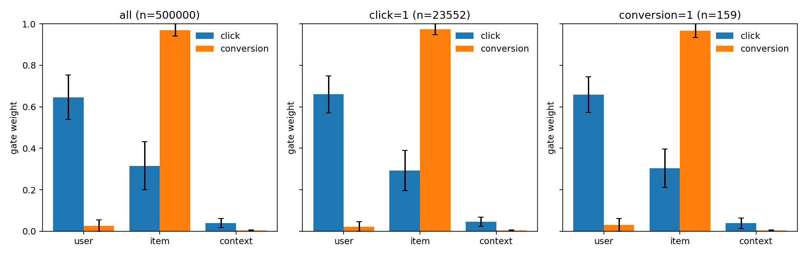

# MT-RankMixer token gate weights

Checkpoint: `/root/autodl-tmp/FuxiCTR/model_zoo/multitask/MT_RankMixer/checkpoints/AliCCP_x1/MTRankMixer_aliccp_semantic_ms_s2025.model`

Rows used: 500000 (cap 500000). Sample standard deviation (n - 1). Gates sum to 1 over tokens inside each task.

| slice | task | n | user mean | user std | item mean | item std | context mean | context std |
| --- | --- | --- | --- | --- | --- | --- | --- | --- |
| all | click | 500000 | 0.645876 | 0.106685 | 0.314944 | 0.115830 | 0.039179 | 0.022231 |
| all | conversion | 500000 | 0.025597 | 0.029230 | 0.970745 | 0.030193 | 0.003658 | 0.002290 |
| click=1 | click | 23552 | 0.660649 | 0.089472 | 0.293571 | 0.096787 | 0.045780 | 0.022247 |
| click=1 | conversion | 23552 | 0.021904 | 0.024672 | 0.974363 | 0.025602 | 0.003733 | 0.002281 |
| conversion=1 | click | 159 | 0.658588 | 0.086070 | 0.303015 | 0.092868 | 0.038397 | 0.024820 |
| conversion=1 | conversion | 159 | 0.029376 | 0.031978 | 0.967195 | 0.033223 | 0.003429 | 0.002125 |

