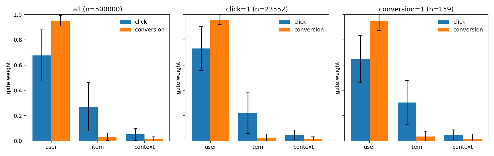
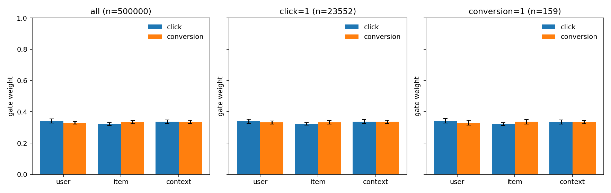

# MT-RankMixer 研究笔记

这篇笔记记的是我在 FuxiCTR 里做的多任务排序，从假设、单种子初步结果、多种子复核、门控塌缩，到残差门控和熵正则。骨干是字节跳动 RankMixer（Zhu 等，CIKM 2025，arXiv:2507.15551）。我自己的部分是 MT-RankMixer。

数字全部来自已经跑完的 RTX 4090 记录，原始表在 `benchmarks/rankmixer/results/`。这是合并到 fork main 前的最后一版。

## 1. 假设

论文里的 RankMixer 把最后一层 token 做一次 mean-pooling，再接到各个任务头。池化权重对所有任务相同。这在单任务排序里说得通。我要做的是广告里的点击（CTR）和转化（CVR）一起学。

我的判断是：这两个任务要看的特征不是同一套。点击更吃曝光上下文；转化更吃用户和商品上的购买意图，而且正样本极少，logloss 在 0.002 这个量级。共享 mean-pooling 把所有 token 压成同一个向量，两个任务的梯度就在抢这一份表示。

所以我假设：如果每个任务自己决定看哪些 token，两边不必妥协成同一个池化向量。我做了两件事。

一是任务感知的 token 门控，替代共享 mean-pooling。共享 trunk 之后，任务 \(k\) 对每个输出 token 打分再混合，然后进自己的 tower：

\[
\alpha_{k,t} = \mathrm{softmax}_t(w_k^\top x_t + b_k), \qquad
h_k = \sum_t \alpha_{k,t} x_t, \qquad
\hat y_k = \mathrm{Tower}_k(h_k).
\]

二是语义 token。`token_grouping: semantic` 时，Ali-CCP 上分成三组：用户 `[101,121,122,124,125,126,127,128,129]`、商品 `[205,206,207,216]`、上下文 `[508,509,702,853,301]`。门控的对象是「用户 / 商品 / 上下文」，而不是按表顺序切出来的匿名块。顺序切块 `sequential` 留作对照。

## 2. 初步结果（单种子，Ali-CCP 部分已被多种子取代）

第一次 GPU 对照是 2026-10-05 12:15:54–12:57:40 CST，AutoDL 上 1 × RTX 4090，commit `5bbf507`，9 个任务全部 exit 0，流水线 2505 秒。公共设置：`epochs=1`，`batch_size=8192`，`embedding_dim=16`，Adam，学习率 `1e-3`，`seed=2025`，无正则、无 dropout。Epoch 时间只计训练。

当时 semantic 的转化 AUC 看起来明显领先。我没有把它当成结论，后面用 3 个种子和 early stopping 复核。复核之后，这一节的 Ali-CCP 表只保留为初步结果，**已被第 3 节和第 6 节的多种子结果取代**。Criteo 没有做多种子，仍是这一档：1 epoch、单种子。

### 2.1 Criteo：骨干是否站得住（1 epoch，单种子 2025）

Criteo_x1 是 FuxiCTR / BARS 全量切分，4029 batch/epoch，约 3300 万训练样本。RankMixer 为 `T=8, D=64, L=2, k=2`，稠密 FFN，顺序切块，输出 MLP `[64]`。

| 模型 | 参数量 | Valid AUC | Valid logloss | Test AUC | Test logloss | Epoch |
| --- | ---: | ---: | ---: | ---: | ---: | ---: |
| DCNv2 | 34,745,121 | 0.808634 | 0.442998 | 0.808973 | 0.442537 | 97 s |
| RankMixer | 33,656,481 | 0.808138 | 0.443553 | 0.808522 | 0.443048 | 114 s |
| DNN | 33,574,497 | 0.806911 | 0.444872 | 0.807165 | 0.444495 | 88 s |
| WuKong | 33,582,393 | 0.806493 | 0.444985 | 0.806889 | 0.444488 | 102 s |

Test AUC 上，RankMixer 比 DNN 高 0.0014（0.808522 − 0.807165），比 WuKong 高 0.0016（0.808522 − 0.806889），比 DCNv2 低 0.0005（0.808522 − 0.808973）。在这组未调参的 1 epoch 设置里，骨干不低于普通 DNN，和 DCNv2 基本持平。我把它当作「主干没有写坏」。参数量都在 3360 万到 3470 万，embedding 占绝大部分。这组数字没有多种子，0.001 量级先当噪声。

### 2.2 Ali-CCP 初步结果（1 epoch，单种子；已被取代）

AliCCP_x1 来自 PaddleRec 公开镜像 https://paddlerec.bj.bcebos.com/datasets/aitm/ ，不是需要学生认证的天池原版。4648 batch/epoch，约 3800 万训练样本，`min_categr_count=10`。语义分组 `T=3, D=48`；顺序切块 `T=8, D=64`。

Test：

| 模型 | 参数量 | click AUC | click logloss | conv AUC | conv logloss | 平均 AUC | Epoch |
| --- | ---: | ---: | ---: | ---: | ---: | ---: | ---: |
| MT-RankMixer（semantic） | 20,478,948 | 0.619737 | 0.161928 | 0.640612 | 0.002067 | 0.630174 | 91 s |
| PLE | 20,738,012 | 0.621780 | 0.161666 | 0.624989 | 0.002128 | 0.623385 | 82 s |
| MT-RankMixer（sequential） | 20,678,612 | 0.617890 | 0.162420 | 0.627733 | 0.002098 | 0.622811 | 98 s |
| ShareBottom | 20,455,634 | 0.621760 | 0.161650 | 0.619310 | 0.002200 | 0.620535 | 69 s |
| MMoE | 20,628,890 | 0.619928 | 0.161709 | 0.618001 | 0.002148 | 0.618964 | 78 s |

Valid：

| 模型 | click AUC | click logloss | conv AUC | conv logloss | 平均 AUC |
| --- | ---: | ---: | ---: | ---: | ---: |
| MT-RankMixer（semantic） | 0.619608 | 0.161800 | 0.643919 | 0.002112 | 0.631764 |
| PLE | 0.621765 | 0.161530 | 0.630583 | 0.002172 | 0.626174 |
| MT-RankMixer（sequential） | 0.617952 | 0.162286 | 0.633717 | 0.002141 | 0.625835 |
| ShareBottom | 0.621575 | 0.161528 | 0.627480 | 0.002239 | 0.624527 |
| MMoE | 0.620067 | 0.161570 | 0.627999 | 0.002188 | 0.624033 |

单种子上，semantic 的转化 AUC 0.640612，比 PLE 的 0.624989 高约 0.016，平均 AUC 也最高；点击略低约 0.002。顺序切块弱于语义分组。我当时的解释是：语义 token 让 CVR 的门能抬高用户和商品。这个解释后来被门控统计推翻了一半，见第 4 节。转化 AUC 领先 0.016 这件事，在多种子下没有复现。

## 3. 多种子复核：单种子优势不成立

我用种子 2025、2026、2027 重跑了三组：语义 per-task gating、同一主干的共享 mean（`task_pooling: mean`）、PLE。超参和初步实验一致：batch 8192，embedding 16，Adam `1e-3`，无正则、无 dropout。Epoch 上限 6，`early_stop_patience: 1`。`monitor: AUC` 是 click AUC 和 conversion AUC 的算术平均，因为 `MultiTaskModel.evaluate` 把这个平均写回裸键 `AUC`。测试指标来自恢复出来的最佳 checkpoint。

服务器上的 expid 是 `*_ms_s{seed}`（门控 checkpoint 为 `MTRankMixer_aliccp_semantic_ms_s2025.model`）。仓库里的模板名是 `*_es`，超参与这次运行一致。原始表见 `benchmarks/rankmixer/results/multiseed_results.md`。标准差是样本标准差（\(n-1\)）。

Test，逐次运行：

| 模型 | 种子 | click AUC | conv AUC | 平均 AUC | click logloss | conv logloss | 最佳 epoch | 跑了几个 epoch | 墙钟 (s) |
| --- | ---: | ---: | ---: | ---: | ---: | ---: | ---: | ---: | ---: |
| per-task gating | 2025 | 0.619847 | 0.630532 | 0.625190 | 0.161871 | 0.001997 | 1 | 2 | 461 |
| per-task gating | 2026 | 0.618528 | 0.622638 | 0.620583 | 0.161309 | 0.002306 | 1 | 2 | 455 |
| per-task gating | 2027 | 0.616664 | 0.628848 | 0.622756 | 0.162280 | 0.002067 | 1 | 2 | 456 |
| 共享 mean | 2025 | 0.620829 | 0.633976 | 0.627402 | 0.162166 | 0.002084 | 1 | 2 | 440 |
| 共享 mean | 2026 | 0.615693 | 0.629497 | 0.622595 | 0.164761 | 0.002122 | 2 | 3 | 589 |
| 共享 mean | 2027 | 0.618209 | 0.631558 | 0.624883 | 0.162030 | 0.002100 | 1 | 2 | 446 |
| PLE | 2025 | 0.619497 | 0.619832 | 0.619665 | 0.162070 | 0.002049 | 1 | 2 | 432 |
| PLE | 2026 | 0.620124 | 0.625897 | 0.623011 | 0.162407 | 0.002042 | 1 | 2 | 450 |
| PLE | 2027 | 0.620211 | 0.632435 | 0.626323 | 0.161919 | 0.002189 | 1 | 2 | 427 |

3 种子均值 ± 标准差：

| 模型 | click AUC | conv AUC | 平均 AUC | click logloss | conv logloss |
| --- | --- | --- | --- | --- | --- |
| per-task gating | 0.61835 ± 0.00160 | 0.62734 ± 0.00416 | 0.62284 ± 0.00230 | 0.16182 ± 0.00049 | 0.00212 ± 0.00016 |
| 共享 mean | 0.61824 ± 0.00257 | 0.63168 ± 0.00224 | 0.62496 ± 0.00240 | 0.16299 ± 0.00154 | 0.00210 ± 0.00002 |
| PLE | 0.61994 ± 0.00039 | 0.62605 ± 0.00630 | 0.62300 ± 0.00333 | 0.16213 ± 0.00025 | 0.00209 ± 0.00008 |

均值之差：门控相对 PLE，点击 −0.00160，转化 +0.00128，平均 −0.00016。门控相对共享 mean，点击 +0.00010，转化 −0.00434，平均 −0.00212。

原 per-task gating 的平均 AUC 是 0.62284，低于 PLE 的 0.62300，也低于共享 mean 的 0.62496。单种子上那次「转化 AUC 0.6406、领先 PLE 约 0.016」没有复现：多种子转化均值只有 0.62734 ± 0.00416，和 PLE 的 0.62605 ± 0.00630 几乎叠在一起，并且比共享 mean 的转化均值低 0.00434。假设的后半段——把门控交给每个任务就会更好——在这组数据上不成立，原门控甚至输给了共享 mean。

除了共享 mean 的种子 2026（最佳 epoch 是 2，跑了 3 个 epoch），这 9 次的最佳 epoch 都是 1，并在下一个 epoch 触发 early stopping。验证集在第一个 epoch 就到顶。

## 4. 原因：转化门控塌缩到商品 token

我没有停在「消融输了」。种子 2025 的门控 checkpoint 上，我对 test 集前 50 万行统计了三个语义 token 的平均门控。完整表在 `benchmarks/rankmixer/results/multiseed_gate_analysis.md`。

全量切片（\(n = 500000\)）：

| 任务 | user | item | context |
| --- | ---: | ---: | ---: |
| click | 0.645876 | 0.314944 | 0.039179 |
| conversion | 0.025597 | 0.970745 | 0.003658 |


转化门控塌到商品 token，均值 0.970745（约 0.971），用户只剩 0.025597，上下文 0.003658。商品这一路的标准差只有 0.030193，是整片样本上的饱和，不是少数样本的偶然。`click=1`（\(n = 23552\)）和 `conversion=1`（\(n = 159\)）切片上同样是商品约 0.97。转化正样本在这 50 万里只有 159 条，这个切片本身很稀，但全量切片已经说明问题：转化头把用户信息丢掉了。

点击和转化的偏好确实不同。点击是用户 0.646、商品 0.315、上下文 0.039；转化几乎只看商品。这支持假设的前半部分：两个任务会争抢表示，门控也确实学出了不同的偏好。它不支持我原先更具体的猜测。我以为点击会留下上下文、转化会看用户和商品。数据里上下文对两个任务都接近 0，转化也没有去看用户。

无约束的 softmax 可以把权重推到单纯形的顶点。转化任务的损失大约 0.002，一旦门控走到商品上，没有别的项把它拉回来。共享 mean 没有这扇门，三个 token 各占 \(1/3\)，用户信息还在，所以转化 AUC 更高。

门控权重不能读成「模型只看了商品嵌入」。\(T = 3\) 时 token mixing 已经把三组切头拼回去，语义身份主要留在残差流上。0.971 表示转化头几乎只走商品那条残差流。

## 5. 针对性改进：残差门控，以及熵正则对照

塌缩的直接原因是门控可以变成 one-hot，而且没有任何东西强制它留下其他 token。我做了两个改动，默认配置仍是原来的 per-task gate，β 默认为 0。

**残差门控池化（主方案）。** 每个任务学一个 sigmoid 标量 \(\lambda_k\)，初始化为 0.5（`lambda_raw` 用 0 初始化，sigmoid 后是 0.5）。池化是共享 mean 和门控混合的凸组合：

\[
h_k = \lambda_k \, \mathrm{mean}_t(x_t) + (1-\lambda_k) \sum_t \alpha_{k,t} x_t.
\]

\(\lambda_k\) 接近 1 时退回共享 mean；接近 0 时退回原来的门控。我希望 \(\lambda\) 停在中间：门控仍能表达任务差异，mean 支路保证没有任何一个 token 被乘成 0。配置是 `task_pooling: residual`。

**熵正则（对照）。** 在损失里减去 \(\beta \sum_k H(\alpha_k)\)，\(H\) 是 batch 上的平均门控熵。β 越大，门越被推向均匀。这次跑的是 `gate_entropy_reg: 0.01`，`gate_temperature: 1.0`，池化仍是原来的 `gate`。

我把 β 选成 0.01，推理是这样的。3 个 token 的最大熵是 \(\ln 3 \approx 1.0986\)，所以每个任务的熵奖励上限大约是 \(0.01 \times 1.099 \approx 0.011\)，大约是点击 logloss（~0.16）的 7%，不会盖过点击损失。β = 0.1 时上限约 0.11，已经和点击损失同量级，会把门直接压向均匀。β = 0.001 时，假如把熵从塌缩附近的 0.15 拉到 0.8，奖励差大约 0.00065，小于转化 logloss（~0.002），我当时判断它拉不动已经贴在顶点上的门。0.01 对应的这段差距大约 0.0065，大于转化损失，我以为它能把转化门从顶点上拨开，又不会走到均匀分布。

这个尺度是按点击损失定的。转化 logloss 只有 0.002 左右，对转化门来说 0.01 偏大。softmax 在顶点附近的熵梯度很陡，一个 epoch 就够把它推走。后面的结果说明 0.01 过冲了。

两次实验的 expid 是 `MTRankMixer_aliccp_semantic_residual_s{seed}` 和 `MTRankMixer_aliccp_semantic_entropy_s{seed}`，种子仍是 2025 / 2026 / 2027，其余超参与多种子复核相同。代码是 commit `5627b6c`。

## 6. 结果：残差版与共享 mean 打平

Test，逐次运行。6 次的最佳 epoch 都是 1，都在第 2 个 epoch 后 early stop。原始表见 `benchmarks/rankmixer/results/anticollapse_results.md`。

| 模型 | 种子 | click AUC | conv AUC | 平均 AUC | click logloss | conv logloss | 最佳 epoch | 跑了几个 epoch | 墙钟 (s) |
| --- | ---: | ---: | ---: | ---: | ---: | ---: | ---: | ---: | ---: |
| 残差门控 | 2025 | 0.620415 | 0.629259 | 0.624837 | 0.161454 | 0.001992 | 1 | 2 | 595 |
| 残差门控 | 2026 | 0.617089 | 0.628573 | 0.622831 | 0.161906 | 0.002129 | 1 | 2 | 604 |
| 残差门控 | 2027 | 0.616937 | 0.634573 | 0.625755 | 0.162661 | 0.002045 | 1 | 2 | 602 |
| 熵正则 0.01 | 2025 | 0.617713 | 0.619608 | 0.618661 | 0.161968 | 0.002142 | 1 | 2 | 595 |
| 熵正则 0.01 | 2026 | 0.620596 | 0.636970 | 0.628783 | 0.161372 | 0.001981 | 1 | 2 | 601 |
| 熵正则 0.01 | 2027 | 0.618898 | 0.628728 | 0.623813 | 0.161878 | 0.002005 | 1 | 2 | 599 |

和上一轮放在一起，3 种子均值 ± 标准差，按平均 AUC 从高到低：

| 模型 | click AUC | conv AUC | 平均 AUC | click logloss | conv logloss |
| --- | --- | --- | --- | --- | --- |
| 共享 mean | 0.61824 ± 0.00257 | 0.63168 ± 0.00224 | 0.62496 ± 0.00240 | 0.16299 ± 0.00154 | 0.00210 ± 0.00002 |
| 残差门控 | 0.61815 ± 0.00197 | 0.63080 ± 0.00328 | 0.62447 ± 0.00150 | 0.16201 ± 0.00061 | 0.00206 ± 0.00007 |
| 熵正则 0.01 | 0.61907 ± 0.00145 | 0.62844 ± 0.00868 | 0.62375 ± 0.00506 | 0.16174 ± 0.00032 | 0.00204 ± 0.00009 |
| PLE | 0.61994 ± 0.00039 | 0.62605 ± 0.00630 | 0.62300 ± 0.00333 | 0.16213 ± 0.00025 | 0.00209 ± 0.00008 |
| 原 per-task gating | 0.61835 ± 0.00160 | 0.62734 ± 0.00416 | 0.62284 ± 0.00230 | 0.16182 ± 0.00049 | 0.00212 ± 0.00016 |

均值之差（平均 AUC）：残差相对 PLE 是 +0.00147，相对原门控约 +0.00163，相对共享 mean 是 −0.00049。熵正则相对 PLE 是 +0.00075，相对共享 mean 是 −0.00121。

残差版是门控类里最好的，平均 AUC 的标准差 0.00150 也是五行里最小的。它比 PLE 和原门控高约 0.0015。它和共享 mean 的差距是 −0.0005，小于共享 mean 自己的标准差 0.00240，也小于残差版的标准差 0.00150。**没有明显胜过共享 mean。**

残差版仍然留着可解释的任务门控。种子 2025、全量 50 万行：

| 模型 | 任务 | user | item | context | 熵 (nats) | λ |
| --- | --- | ---: | ---: | ---: | ---: | ---: |
| 残差门控 | click | 0.676654 | 0.271431 | 0.051916 | 0.659136 | 0.531656 |
| 残差门控 | conversion | 0.952436 | 0.032427 | 0.015138 | 0.203124 | 0.498624 |
| 熵正则 0.01 | click | 0.341014 | 0.322071 | 0.336916 | 1.097763 | — |
| 熵正则 0.01 | conversion | 0.330860 | 0.334056 | 0.335084 | 1.098189 | — |

λ 大约是点击 0.532、转化 0.499，都停在初始化 0.5 附近。有效权重是 \(\lambda/3 + (1-\lambda)\alpha\)。转化这一侧大约是用户 0.644、商品 0.183、上下文 0.174，也就是用户约 0.64、商品约 0.18、上下文约 0.17。没有任何一个 token 再独占混合向量。把用户信息留在池化里，是残差版比原门控高出来的那一截转化 AUC（0.63080 对 0.62734）最说得通的原因。

门控支路本身仍会饱和。转化门从原来的商品 0.971，改饱和到用户 0.952，熵只有 0.203。平衡来自 mean 支路，不是因为门控自己变得温和。点击门控还是偏向用户（0.677），熵 0.659，比转化门健康一些。



熵正则 0.01 把两扇门都压成均匀。点击熵 1.097763，转化熵 1.098189，上限是 1.0986。权重约 0.33 / 0.33 / 0.33，任务之间几乎没有差别。这和共享 mean 是同一件事，选择性没有留下来。平均 AUC 0.62375 ± 0.00506 是五行里方差最大的，种子 2025 的平均 AUC 只有 0.618661，种子 2026 又到 0.628783。β = 0.01 过冲了。



这轮单次墙钟大约 595–604 秒，上一轮大约 427–589 秒。两次用的驱动不同，时间不能直接比。`anticollapse_summary.csv` 里 `gate_entropy_s2025` 和 `gate_residual_s2025` 两行是 `failed`：汇总脚本只解析训练日志，把分析日志当成了失败的训练。对应的 markdown 和 png 是成功的，上面的门控表来自那两份分析。

## 7. 反思与以后做什么

这组实验把故事收成三句。共享池化确实会让两个任务抢表示，点击和转化的门控偏好不同。无约束的 per-task softmax 会塌缩，转化头丢掉用户信息，单种子上的 0.016 转化优势是噪声。残差池化能把有效权重拉回一个还看得懂的混合，但它没有明显胜过共享 mean。

后面如果还做，我会先处理这几件已经看见的限制：

- Ali-CCP 上语义 token 只有 3 个。混合之后每个位置都是三组切头的拼接，门控的选择空间很窄，上下文从一开始就接近 0。更细的 token（场景、位置、类目拆开）才有机会让点击门真正用上上下文。
- 转化正样本极少。50 万行里 `conversion=1` 只有 159 条，转化 logloss 在 0.002。AUC 的种子方差因此很大，PLE 的转化标准差是 0.00630，熵正则是 0.00868。0.001 量级的平均 AUC 差距盖不住这个方差。
- 除共享 mean 的种子 2026 以外，所有运行的最佳 epoch 都是 1。第一个 epoch 就过拟合，early stopping 把后面的 epoch 切掉了。残差的 λ 几乎停在 0.5，也可能只是还没被优化移动。需要看更长的训练，或者更小的学习率，确认 λ 和学习到的门是不是第一个 epoch 的偶然。
- β = 0.01 过冲到均匀。下一档应该试更小的 β，例如 0.001–0.003，让熵奖励和转化损失同一量级，而不是和点击损失比。
- 残差版的门控支路仍饱和在用户 0.952。mean 支路挡住了「有效权重变成 one-hot」，没有挡住门控自己变成 one-hot。温度、更小的熵惩罚，或者对门控支路单独加约束，都还没试。
- 数据仍是 Ali-CCP 公开镜像，稠密宽度远小于论文里的 100M / 1B。语义分组和顺序切块的稠密 FFN 容量也不同（约 55296 对 262144），那组单种子对照不能单独当成分组的因果结论。需要在更大数据上再验证一次。

`loss_weight: EQ` 仍把两份 batch 平均的 binary cross-entropy 直接相加，没有按正样本率加权。我这一轮没有同时改损失，为的是和 MMoE / PLE 的配置对齐。不对称损失、task-specific token、不对称 tower，都还没有实验。

## 8. 方法备忘

这一节保留设计时的取舍，避免后面只剩结果表。

**为什么 \(H = T\)。** Token mixing 没有参数：每个 token 切成 \(H\) 个头，第 \(h\) 个混合 token 是所有 token 的第 \(h\) 个头拼起来。论文把 \(H\) 设成 \(T\)，混合后维度仍是 \(D\)，残差可以直接加。`token_dim` 必须能被 `num_tokens` 整除。语义分组只有 3 个 token 时，\(D\) 选 48，因为 \(48 \bmod 3 = 0\)。

**为什么门控放在 mixing 之后。** Mixing 之前按任务选 token，会绕开组间交换。放在 mixing 和 per-token FFN 之后，门控选的是已经交换过、又被残差拉回来的流。

**sigmoid 门做 L1 归一化。** Softmax 自然和为 1。裸 sigmoid 的和会跟着激活的 token 数变，tower 的输入尺度就和门的形状混在一起。L1 之后两种门都在单纯形上，和 mean-pool 的尺度对齐。分母用 `clamp_min(1e-6)`。

**参数量。** 我没有把稠密层做成论文的 100M / 1B。Criteo 上顺序 RankMixer 的稠密 FFN 大约 \(2kLTD^2 = 2\times 2\times 2\times 8\times 64^2 = 262144\)，总参数 33,656,481。Ali-CCP semantic 的稠密 FFN 大约 \(2\times 2\times 2\times 3\times 48^2 = 55296\)。门控本身是每个任务一个 `Linear(D, 1)`，semantic 下 \(2\times(48+1) = 98\) 个参数。共享 mean 消融固定 \(T\)、\(D\)、分组和 tower，只去掉这 98 个参数，比的是有没有 per-task 权重。残差版在此之上每个任务多一个标量 λ。

**和 MMoE 的差别。** MMoE 的专家读同一份展平嵌入。这里的 per-token FFN 各看各的 token，任务门控发生在 mixing 之后，对象是 token。

**开关。** `task_pooling: gate` 是默认。`task_pooling: mean` 或 `gate_type: mean` 是共享 mean。`task_pooling: residual` 是第 5 节的混合，不能再同时把 `gate_type` 设成 `mean`。`gate_entropy_reg` 默认 0；这次对照用 0.01。`gate_temperature` 默认 1，除 logits 再做 softmax 或 sigmoid。

层实现在 `fuxictr/pytorch/layers/interactions/rankmixer.py`。单任务模型在 `model_zoo/RankMixer/`，多任务在 `model_zoo/multitask/MT_RankMixer/`。

## 附录 A. CPU 自测日志

下面是 2026-10-04 在 CPU 上、tiny 数据、各 1 个 epoch 的原始日志。tiny 集大约 100 条，AUC 不能当效果。当时单元测试 14 个，`Ran 14 tests in 0.952s`，`OK`。当前 `tests/unit_tests/models/test_rankmixer.py` 有 20 个测试，覆盖共享池化、残差 λ、熵正则和日志解析。`tests/test_torch.sh` 仍会在缺失的 `model_zoo/DCNv3` 处停住，这是改 RankMixer 之前就有的问题。

```
========== RankMixer_test ==========
Total number of parameters: 29489.
Train loss: 0.459504
[Metrics] AUC: 0.937500
****** Validation evaluation ******
[Metrics] logloss: 0.138507 - AUC: 0.937500
******** Test evaluation ********
[Metrics] logloss: 0.138507 - AUC: 0.937500

========== RankMixer_semantic_test ==========
Total number of parameters: 20457.
Train loss: 0.283468
[Metrics] AUC: 1.000000
****** Validation evaluation ******
[Metrics] logloss: 0.109328 - AUC: 1.000000
******** Test evaluation ********
[Metrics] logloss: 0.109328 - AUC: 1.000000

========== RankMixer_moe_test ==========
Total number of parameters: 14073.
Train loss: 0.175467
[Metrics] AUC: 0.997396
****** Validation evaluation ******
[Metrics] logloss: 0.133811 - AUC: 0.997396
******** Test evaluation ********
[Metrics] logloss: 0.133811 - AUC: 0.997396

========== MTRankMixer_test ==========
Total number of parameters: 25484.
Train loss: 1.059085
[Task: click][Metrics] AUC: 0.563830
[Task: conversion][Metrics] AUC: 0.484848
****** Validation evaluation ******
[Task: click][Metrics] logloss: 0.277203 - AUC: 0.563830
[Task: conversion][Metrics] logloss: 0.427931 - AUC: 0.484848
******** Test evaluation ********
[Task: click][Metrics] logloss: 0.277203 - AUC: 0.563830
[Task: conversion][Metrics] logloss: 0.427931 - AUC: 0.484848

========== MTRankMixer_group_test ==========
Total number of parameters: 32300.
Train loss: 0.590076
[Task: click][Metrics] AUC: 0.673759
[Task: conversion][Metrics] AUC: 0.131313
****** Validation evaluation ******
[Task: click][Metrics] logloss: 0.224258 - AUC: 0.673759
[Task: conversion][Metrics] logloss: 0.092097 - AUC: 0.131313
******** Test evaluation ********
[Task: click][Metrics] logloss: 0.224258 - AUC: 0.673759
[Task: conversion][Metrics] logloss: 0.092097 - AUC: 0.131313
```

共享 mean-pool 的 CPU 冒烟是 `MTRankMixer_mean_test`。同一 tiny 主干上，门控版 25484 个参数，mean-pool 版 25418 个，差值 66，等于两个 `Linear(32, 1)`。tiny 上的 AUC 不记录为结果。

## 附录 B. 文件

| 路径 | 作用 |
| --- | --- |
| `fuxictr/pytorch/layers/interactions/rankmixer.py` | Token 切分、Token Mixing、Per-token FFN、Sparse-MoE、任务门控 |
| `model_zoo/RankMixer/` | 单任务模型与 Criteo / tiny 配置 |
| `model_zoo/multitask/MT_RankMixer/` | 多任务模型；`task_pooling`、λ 和熵正则在 `src/MTRankMixer.py` |
| `tests/unit_tests/models/test_rankmixer.py` | 形状、门控和为 1、FFN 独立、共享池化、残差、熵正则 |
| `benchmarks/rankmixer/run_gpu_benchmark.sh` | 已经跑完的 1 epoch 对照 |
| `benchmarks/rankmixer/run_multiseed.sh` | 3 模型 × 3 种子，early stopping |
| `benchmarks/rankmixer/run_anticollapse.sh` | 残差门控与熵正则，各 3 个种子 |
| `benchmarks/rankmixer/analyze_gates.py` | 门控均值、熵、λ 和 png |
| `benchmarks/rankmixer/results/` | 多种子与防塌缩的原始表、门控分析和汇总 csv |
| `docs/img/rankmixer/` | 三张门控权重图 |
