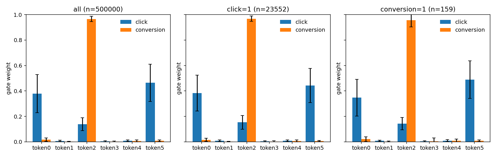
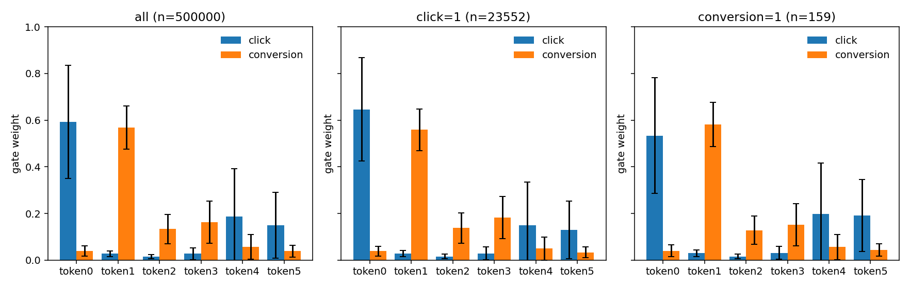
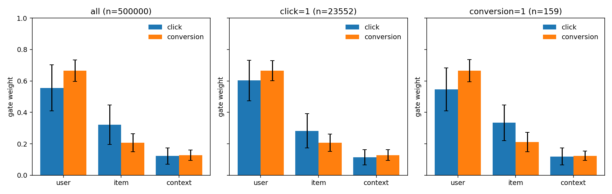

# MT-RankMixer 研究笔记

这篇笔记记的是我在 FuxiCTR 里做的多任务排序扩展和诊断。顺序是：协议，然后是已经跑完的验证集研究，再往后才是开发期的假设、单种子、多种子复核、门控塌缩、残差门控和细粒度 token 扫描。骨干是字节跳动 RankMixer（Zhu 等，CIKM 2025，arXiv:2507.15551）。我自己的部分是 MT-RankMixer。

第 2–7 节是开发期研究：当时用 test 做了诊断和选择。那些表保留，但它们回答的是开发过程里我看到了什么。2026-10-07 的验证集研究取代它们，作为当时的选择依据。后面的「后续实验」又做了三件事：把 PLE 在验证集上调公平、用固定权重代替按 batch 的 NORM、在点击行上补 clicked-only CVR，然后对预注册的 55 个 checkpoint 读了一次 test。那一次 test 不参与选择。

三个指标分开写。click AUC 是点击。曝光级转化 AUC 定义在整条曝光上。clicked-only CVR AUC 只在 click=1 的行上用转化头排序。`p_conv/p_click` 是同一批点击行的另一种排序。

## 协议更正（Protocol correction）

前面几节的数字我改称为**开发期研究**。训练、门控诊断、结构选择和写进表里的对比，用的都是同一份 test。验证集只参与 early stopping。test 被看了很多次，不能再当作「最后只碰一次」的最终测试。

现在的流程是：

1. 训练。Early stopping 看验证集上 click AUC 和曝光级转化 AUC 的平均。`run_rigor_suite.sh` 给 `run_expid.py` 加 `--skip_test`，训练日志里不读 test。
2. 分析和选择只用验证集。`analyze_gates.py --stage valid` 是默认值。多种子门控在验证集上汇总成均值 ± 样本标准差。
3. 设计冻结之后，才用 `run_final_test.sh` 对每个冻结 checkpoint 读一次 test。这一步不会被 rigor suite 调用。这一轮冻结的集合是全部 7 个变体，不按验证集再挑一个赢家。

`--stage test` 还留着，给冻结后的最终报告，以及复现开发期已经跑完的 test 门控表。`run_sweep.sh` 和 `run_anticollapse.sh` 显式传 `--stage test`，避免默认值改成 valid 之后悄悄改变旧实验。

T=6 有一个混杂。从 3 个语义 token 换成 6 个，同时改了字段怎么分组、PerTokenFFN 的个数、mixing 的 \(H=T\) 和 `head_dim=D/T`，以及 tokenizer 的投影。开发期里「6 token 比 3 token 高大约 0.0019」不能写成语义分解已经赢了。验证集对照把 T、D、L、k、优化器和池化对齐 `g6_mean`（共享 mean），只改 18 个字段怎么切成 6 组：

| 变体 | 分组 | 池化 |
| --- | --- | --- |
| g3_mean | 原来的用户 / 商品 / 上下文 | mean |
| g6_mean | 现在的 6 组语义 | mean |
| g6_residual | 同一套 6 组语义 | residual |
| g6_gate | 同一套 6 组语义 | gate |
| g6_random | 随机 6 组，每组 3 个字段，划分种子 42 | mean |
| g6_sequential | 按字段表顺序切成 6 组，每组 3 个字段 | mean |
| PLE | 无 token | — |

`g6_random` 的划分用固定的 Fisher-Yates，只调用 `random.Random(42).random()`，和训练种子无关。打乱之后的分组写进 `benchmarks/rankmixer/configs/rigor/model_config.yaml`，不在每次训练时重抽。`g6_sequential` 的顺序就是特征列表 `101, 121, …, 301`。

语义 6 组的大小是 1、8、1、3、4、1，每组投影是 `Linear(组大小 × 16, 48)`。随机组和顺序组都是 3+3+3+3+3+3，投影都是 `Linear(48, 48)`。这组对照拿掉的是「我按语义亲手切组」和「T 从 3 变到 6」绑在一起的那件事。投影参数量并没有和 `g6_mean` 对齐。验证集结果出来之后，语义分组并没有高于随机切分，见下一节。

这轮实际跑的是 5 个种子：2025、2026、2027、2028、2029。预算：batch 8192，embedding 16，Adam `1e-3`，epoch 上限 10，`early_stop_patience: 3`。相对旧设置 patience 1、epoch 上限 6，这是一次敏感度检查。34/35 次的最佳验证点仍然在 epoch 1。

`loss_weight: EQ` 是两份二元交叉熵的直接相加，没有按任务归一。训练默认仍是 EQ。`MultiTaskModel.combine_task_losses` 另外接受一列手动权重，或 `NORM`（每个任务损失先除以自己的 detach 绝对值再相加）。这两档不进这轮 rigor 配置。梯度审计的数字在下一节。

Ali-CCP 没有官方验证集。这份数据来自 PaddleRec 公开镜像，预处理对齐 AITM 的 `process_public_dataset.py`：`random.seed(2020)`，处理过的训练行在 `random.random() >= 0.9` 时放进 dev，大约 10%，不是按文件顺序切前 10%。官方 test 文件单独留下。

```bash
# 已经跑完的一轮（种子 2025–2029，test 未读）：
SEEDS="2025 2026 2027 2028 2029" bash benchmarks/rankmixer/run_rigor_suite.sh 0
# 后续实验和一次性 test 已经跑完，见「后续实验」。重跑：
# OUT=/root/autodl-tmp/fu_out RG_OUT=/root/autodl-tmp/rg_out bash benchmarks/rankmixer/run_followup.sh 0
```

汇总脚本以前把 `gate_*.log` 当成失败的训练。现在只解析 `run_expid` 的训练日志。已经归档的开发期 csv 没有改，里面那些 `failed` 行仍是旧脚本留下的。

## 验证集研究（2026-10-07，5 种子）

这一节的数字来自 AutoDL 上的 `run_rigor_suite.sh`，2026-10-07 16:00 CST 写完 `ALL_DONE`。7 个变体 × 5 个种子（2025–2029）= 35 次训练，全部 exit 0。`patience=3`，epoch 上限 10，损失是 EQ，`gate_stage=valid`，`--skip_test`。**test 没有被读。** 原文、逐次 csv、门控多种子汇总和梯度审计归档在 `benchmarks/rankmixer/results/rigor/`。Checkpoint 大约 2.7 GB，留在 AutoDL 的 `/root/autodl-tmp/rg_out/checkpoints/`，没有拷进仓库。

### 均值 ± 样本标准差（n=5），按平均 AUC 排序

| 变体 | n | click AUC | 曝光级转化 AUC | 平均 AUC |
| --- | --- | --- | --- | --- |
| g6_gate | 5 | 0.61886 ± 0.00142 | 0.64139 ± 0.00589 | 0.63013 ± 0.00346 |
| g6_random | 5 | 0.61936 ± 0.00224 | 0.63956 ± 0.00502 | 0.62946 ± 0.00303 |
| g6_residual | 5 | 0.62009 ± 0.00126 | 0.63829 ± 0.00393 | 0.62919 ± 0.00228 |
| g6_mean | 5 | 0.61960 ± 0.00149 | 0.63589 ± 0.00568 | 0.62775 ± 0.00348 |
| g3_mean | 5 | 0.61790 ± 0.00114 | 0.63615 ± 0.00237 | 0.62702 ± 0.00154 |
| g6_sequential | 5 | 0.61991 ± 0.00225 | 0.63352 ± 0.00503 | 0.62672 ± 0.00211 |
| PLE | 5 | 0.61823 ± 0.00274 | 0.63136 ± 0.00651 | 0.62480 ± 0.00441 |

变体之间的平均 AUC 跨度是 0.62480–0.63013，变体内标准差是 0.00154–0.00441。两者同一量级。

### 配对检验（同一种子，A − B，双侧 t，df=4）

| 比较 | 指标 | 均值差 ± 标准差 | A 赢的种子 | t | p |
| --- | --- | --- | --- | --- | --- |
| g6_mean − g3_mean | click | +0.00171 ± 0.00194 | 4/5 | +1.96 | 0.121 |
| g6_mean − g3_mean | 曝光级转化 | −0.00026 ± 0.00589 | 3/5 | −0.10 | 0.926 |
| g6_mean − g3_mean | 平均 | +0.00072 ± 0.00379 | 3/5 | +0.43 | 0.692 |
| g6_mean − g6_random | click | +0.00024 ± 0.00186 | 3/5 | +0.29 | 0.788 |
| g6_mean − g6_random | 曝光级转化 | −0.00367 ± 0.00888 | 1/5 | −0.92 | 0.408 |
| g6_mean − g6_random | 平均 | −0.00171 ± 0.00502 | 2/5 | −0.76 | 0.488 |
| g6_mean − g6_sequential | click | −0.00031 ± 0.00262 | 2/5 | −0.27 | 0.803 |
| g6_mean − g6_sequential | 曝光级转化 | +0.00237 ± 0.00865 | 1/5 | +0.61 | 0.573 |
| g6_mean − g6_sequential | 平均 | +0.00103 ± 0.00474 | 2/5 | +0.49 | 0.652 |
| g6_random − g6_sequential | click | −0.00055 ± 0.00256 | 2/5 | −0.48 | 0.655 |
| g6_random − g6_sequential | 曝光级转化 | +0.00604 ± 0.00788 | 3/5 | +1.71 | 0.162 |
| g6_random − g6_sequential | 平均 | +0.00274 ± 0.00421 | 3/5 | +1.46 | 0.219 |
| g6_random − g3_mean | click | +0.00147 ± 0.00286 | 4/5 | +1.14 | 0.316 |
| g6_random − g3_mean | 曝光级转化 | +0.00341 ± 0.00445 | 4/5 | +1.71 | 0.162 |
| g6_random − g3_mean | 平均 | +0.00244 ± 0.00326 | 4/5 | +1.67 | 0.170 |
| g6_sequential − g3_mean | click | +0.00202 ± 0.00193 | 4/5 | +2.33 | 0.080 |
| g6_sequential − g3_mean | 曝光级转化 | −0.00263 ± 0.00703 | 2/5 | −0.84 | 0.449 |
| g6_sequential − g3_mean | 平均 | −0.00031 ± 0.00353 | 2/5 | −0.19 | 0.855 |
| g6_residual − g6_mean | click | +0.00049 ± 0.00152 | 3/5 | +0.72 | 0.510 |
| g6_residual − g6_mean | 曝光级转化 | +0.00240 ± 0.00512 | 3/5 | +1.05 | 0.355 |
| g6_residual − g6_mean | 平均 | +0.00144 ± 0.00322 | 3/5 | +1.00 | 0.373 |
| g6_gate − g6_mean | click | −0.00074 ± 0.00171 | 1/5 | −0.96 | 0.389 |
| g6_gate − g6_mean | 曝光级转化 | +0.00550 ± 0.00767 | 4/5 | +1.60 | 0.184 |
| g6_gate − g6_mean | 平均 | +0.00238 ± 0.00451 | 4/5 | +1.18 | 0.303 |
| g6_residual − g6_gate | click | +0.00123 ± 0.00167 | 3/5 | +1.65 | 0.175 |
| g6_residual − g6_gate | 曝光级转化 | −0.00311 ± 0.00762 | 2/5 | −0.91 | 0.414 |
| g6_residual − g6_gate | 平均 | −0.00094 ± 0.00456 | 2/5 | −0.46 | 0.669 |
| g6_mean − PLE | click | +0.00137 ± 0.00381 | 3/5 | +0.81 | 0.465 |
| g6_mean − PLE | 曝光级转化 | +0.00453 ± 0.00735 | 4/5 | +1.38 | 0.241 |
| g6_mean − PLE | 平均 | +0.00295 ± 0.00545 | 4/5 | +1.21 | 0.293 |
| g6_residual − PLE | click | +0.00187 ± 0.00367 | 4/5 | +1.14 | 0.319 |
| g6_residual − PLE | 曝光级转化 | +0.00692 ± 0.00867 | 4/5 | +1.79 | 0.149 |
| g6_residual − PLE | 平均 | +0.00439 ± 0.00593 | 4/5 | +1.66 | 0.173 |
| g6_gate − PLE | click | +0.00064 ± 0.00379 | 2/5 | +0.38 | 0.726 |
| g6_gate − PLE | 曝光级转化 | +0.01003 ± 0.00946 | 5/5 | +2.37 | 0.077 |
| g6_gate − PLE | 平均 | +0.00533 ± 0.00653 | 5/5 | +1.83 | 0.142 |
| g3_mean − PLE | click | −0.00033 ± 0.00249 | 1/5 | −0.30 | 0.781 |
| g3_mean − PLE | 曝光级转化 | +0.00479 ± 0.00492 | 4/5 | +2.18 | 0.095 |
| g3_mean − PLE | 平均 | +0.00223 ± 0.00352 | 4/5 | +1.42 | 0.229 |

平均 AUC 上没有任何一行 p<0.1。最小的是 g6_gate − PLE，p=0.142。有三行单指标低于 0.1：g6_sequential − g3_mean 的 click，p=0.080；g6_gate − PLE 的曝光级转化，p=0.077；g3_mean − PLE 的曝光级转化，p=0.095。n=5、df=4，功效低。我没有把这三行写成变体已经分开。归档的 `rigor_results.md` 在表后面写了「没有任何比较达到 p<0.1」。那一句和表不一致，原文照归档，这里以表为准。`g6_random` 和 `g6_sequential` 对 PLE 没有配对行，我不补。

### 逐次验证集结果

下表按归档稿四舍五入到 5 位小数。完整精度在 `rigor_summary.csv`。test 列是空的。

| 变体 | 种子 | 最佳 epoch | valid click | valid 曝光级转化 | valid 平均 | 训练秒 |
| --- | --- | --- | --- | --- | --- | --- |
| PLE | 2025 | 1 | 0.61957 | 0.63555 | 0.62756 | 767 |
| PLE | 2026 | 2 | 0.61355 | 0.62105 | 0.61730 | 916 |
| PLE | 2027 | 1 | 0.61808 | 0.63688 | 0.62748 | 731 |
| PLE | 2028 | 1 | 0.62029 | 0.63441 | 0.62735 | 724 |
| PLE | 2029 | 1 | 0.61965 | 0.62891 | 0.62428 | 669 |
| g3_mean | 2025 | 1 | 0.61857 | 0.63827 | 0.62842 | 790 |
| g3_mean | 2026 | 1 | 0.61724 | 0.63230 | 0.62477 | 784 |
| g3_mean | 2027 | 1 | 0.61685 | 0.63558 | 0.62621 | 771 |
| g3_mean | 2028 | 1 | 0.61725 | 0.63757 | 0.62741 | 769 |
| g3_mean | 2029 | 1 | 0.61957 | 0.63703 | 0.62830 | 775 |
| g6_gate | 2025 | 1 | 0.61839 | 0.63735 | 0.62787 | 875 |
| g6_gate | 2026 | 1 | 0.62051 | 0.64669 | 0.63360 | 873 |
| g6_gate | 2027 | 1 | 0.61901 | 0.64863 | 0.63382 | 871 |
| g6_gate | 2028 | 1 | 0.61966 | 0.63888 | 0.62927 | 889 |
| g6_gate | 2029 | 1 | 0.61675 | 0.63541 | 0.62608 | 887 |
| g6_mean | 2025 | 1 | 0.62122 | 0.64450 | 0.63286 | 799 |
| g6_mean | 2026 | 1 | 0.62102 | 0.63561 | 0.62832 | 853 |
| g6_mean | 2027 | 1 | 0.61943 | 0.63763 | 0.62853 | 842 |
| g6_mean | 2028 | 1 | 0.61790 | 0.63009 | 0.62400 | 858 |
| g6_mean | 2029 | 1 | 0.61843 | 0.63161 | 0.62502 | 850 |
| g6_random | 2025 | 1 | 0.62143 | 0.63864 | 0.63003 | 848 |
| g6_random | 2026 | 1 | 0.62094 | 0.63582 | 0.62838 | 851 |
| g6_random | 2027 | 1 | 0.61771 | 0.63908 | 0.62840 | 856 |
| g6_random | 2028 | 1 | 0.62045 | 0.64814 | 0.63430 | 857 |
| g6_random | 2029 | 1 | 0.61628 | 0.63611 | 0.62620 | 851 |
| g6_residual | 2025 | 1 | 0.62000 | 0.64094 | 0.63047 | 913 |
| g6_residual | 2026 | 1 | 0.62191 | 0.63951 | 0.63071 | 918 |
| g6_residual | 2027 | 1 | 0.61844 | 0.63732 | 0.62788 | 892 |
| g6_residual | 2028 | 1 | 0.61965 | 0.63193 | 0.62579 | 891 |
| g6_residual | 2029 | 1 | 0.62046 | 0.64173 | 0.63109 | 882 |
| g6_sequential | 2025 | 1 | 0.62057 | 0.62668 | 0.62362 | 846 |
| g6_sequential | 2026 | 1 | 0.62126 | 0.63752 | 0.62939 | 835 |
| g6_sequential | 2027 | 1 | 0.61591 | 0.63933 | 0.62762 | 843 |
| g6_sequential | 2028 | 1 | 0.62069 | 0.63169 | 0.62619 | 844 |
| g6_sequential | 2029 | 1 | 0.62113 | 0.63237 | 0.62675 | 828 |

35 次里 34 次的最佳验证 AUC 在 epoch 1。唯一的例外是 PLE 种子 2026，最佳 epoch 2，平均 AUC 0.61730，训练 916 秒，也是 PLE 的离群点。patience=3 意味着每次大约训练了 4 个 epoch，然后留下 epoch 1 的 checkpoint。

### 门控：每个种子塌到哪里（验证集，slice=all）

| 变体 | 种子 | 任务 | 最大 token（权重） | 第二 token（权重） | 熵（nats） |
| --- | --- | --- | --- | --- | --- |
| g6_gate | 2025 | click | scenario (0.432) | user_id (0.309) | 1.143 |
| g6_gate | 2025 | 曝光级转化 | item_id (0.976) | user_id (0.009) | 0.140 |
| g6_gate | 2026 | click | scenario (0.887) | item_attr (0.094) | 0.391 |
| g6_gate | 2026 | 曝光级转化 | item_attr (0.982) | scenario (0.005) | 0.113 |
| g6_gate | 2027 | click | cross (0.407) | user_id (0.398) | 1.079 |
| g6_gate | 2027 | 曝光级转化 | user_profile (0.961) | scenario (0.018) | 0.195 |
| g6_gate | 2028 | click | item_id (0.849) | user_id (0.124) | 0.467 |
| g6_gate | 2028 | 曝光级转化 | item_attr (0.984) | scenario (0.008) | 0.097 |
| g6_gate | 2029 | click | item_id (0.651) | scenario (0.311) | 0.740 |
| g6_gate | 2029 | 曝光级转化 | user_profile (0.991) | scenario (0.006) | 0.061 |
| g6_residual | 2025 | click | user_id (0.673) | cross (0.139) | 0.815 |
| g6_residual | 2025 | 曝光级转化 | user_profile (0.536) | item_attr (0.227) | 1.224 |
| g6_residual | 2026 | click | scenario (0.905) | cross (0.033) | 0.406 |
| g6_residual | 2026 | 曝光级转化 | item_attr (0.614) | user_profile (0.258) | 1.012 |
| g6_residual | 2027 | click | user_id (0.601) | cross (0.159) | 1.103 |
| g6_residual | 2027 | 曝光级转化 | user_profile (0.920) | scenario (0.024) | 0.381 |
| g6_residual | 2028 | click | user_id (0.956) | item_id (0.014) | 0.185 |
| g6_residual | 2028 | 曝光级转化 | user_profile (0.710) | scenario (0.170) | 0.806 |
| g6_residual | 2029 | click | item_id (0.947) | user_id (0.030) | 0.170 |
| g6_residual | 2029 | 曝光级转化 | user_profile (0.988) | cross (0.005) | 0.076 |

`g6_gate` 的转化门在 5/5 个种子上都把 0.96–0.99 的权重放在一个 token 上。那个 token 不是同一个：item_id、item_attr、user_profile 都出现了。跨种子的平均权重因此标准差很大，不能读成「转化稳定地看某一个字段」。完整的跨种子均值 ± 标准差在 `g6_gate_seeds.md` 和 `g6_residual_seeds.md`。slice=all 上，`g6_gate` 转化的 user_profile 是 0.391532 ± 0.533526，item_attr 是 0.393750 ± 0.537691，item_id 是 0.197542 ± 0.435054。标准差和均值同一量级，因为众数在种子之间跳。

熵的跨种子汇总（样本标准差，slice=all）：

| 变体 | 任务 | 熵 |
| --- | --- | --- |
| g6_gate | click | 0.764166 ± 0.343040 |
| g6_gate | 曝光级转化 | 0.121305 ± 0.050015 |
| g6_residual | click | 0.535870 ± 0.410238 |
| g6_residual | 曝光级转化 | 0.699623 ± 0.467691 |

残差池化把转化门熵从 0.121305 ± 0.050015 抬到 0.699623 ± 0.467691。种子 2027（0.920）和 2029（0.988）的残差转化门仍然超过 0.9，都在 user_profile 上。

λ 是残差公式里 mean 路径的权重，初始化是 sigmoid(0)=0.5。5 个种子：

| 任务 | n | λ |
| --- | --- | --- |
| click | 5 | 0.506983 ± 0.003786 |
| 曝光级转化 | 5 | 0.499401 ± 0.004778 |

它几乎没离开 0.5。可学习的 λ 在这轮里没有学出一个混合比。

下面两张图只是种子 2025 的验证集、slice=all，不是 5 个种子的平均。`g6_gate`：点击 scenario 0.432、user_id 0.309，熵 1.143；转化 item_id 0.976，熵 0.140。`g6_residual`：点击 user_id 0.673、cross 0.139，熵 0.815；转化 user_profile 0.536、item_attr 0.227，熵 1.224。


开发期的 test 切片图还在 `docs/img/rankmixer/gate_g6_gate_s2025.png` 和 `gate_g6_residual_s2025.png`。那是种子 2025 的 test，参加过选择，不拿来和上面这两张混读。

### 梯度审计

对象是 `g6_mean` 种子 2025 的 checkpoint，`/root/autodl-tmp/rg_out/checkpoints/AliCCP_x1/MTR_rg_g6_mean_s2025.model`。验证集 4 个 batch，权重没有更新。Trunk 是 `embedding_layer`、`tokenizer`、`encoder`。Tower、token 门和 λ 在 trunk 外面。

EQ 是两份任务 mean BCE 的直接和，不除以任务数，也不按损失大小重标定。这一个 checkpoint 上，click 的 batch mean BCE 在 0.184–0.206，曝光级转化在 3.5e-4 到 7.0e-3。

| batch | 任务 | mean BCE | trunk grad L2 | full grad L2 |
| --- | --- | --- | --- | --- |
| 0 | click | 1.994854e-01 | 4.367441e-02 | 8.732463e-02 |
| 0 | 曝光级转化 | 3.527260e-04 | 3.806648e-03 | 5.282336e-03 |
| 0 | EQ 和 | 1.998381e-01 | 4.364979e-02 | |
| 1 | click | 1.841090e-01 | 2.862097e-02 | 4.393965e-02 |
| 1 | 曝光级转化 | 6.954777e-03 | 5.592431e-03 | 7.258824e-03 |
| 1 | EQ 和 | 1.910638e-01 | 2.996712e-02 | |
| 2 | click | 2.036224e-01 | 3.919430e-02 | 7.056644e-02 |
| 2 | 曝光级转化 | 5.704362e-03 | 4.667883e-03 | 5.805979e-03 |
| 2 | EQ 和 | 2.093268e-01 | 4.013031e-02 | |
| 3 | click | 2.064197e-01 | 6.105788e-02 | 1.061460e-01 |
| 3 | 曝光级转化 | 3.225296e-03 | 2.052153e-03 | 2.083440e-03 |
| 3 | EQ 和 | 2.096450e-01 | 6.099360e-02 | |

4 个 batch 的 trunk L2 均值：click 4.313689e-02，曝光级转化 4.029779e-03，比值 10.7045。点击把共享 trunk 推得大约是转化的 10.7 倍。这是一个 checkpoint、4 个 batch，是指示，不是总体估计。NORM 没有在这轮打开。

### 我哪里写错了，协议改了什么

开发期我把「共享 mean 从 3 个 token 的 0.62496 到 6 个 token 的 0.62687，大约 +0.0019」写成主要的数字差异，并倾向于把它理解成更细的语义切分。验证集上这句没有复现。g6_mean − g3_mean 的平均 AUC 是 +0.00072 ± 0.00379，3/5，p=0.692。随机 6 组的平均 AUC 0.62946 ± 0.00303 不低于语义 6 组的 0.62775 ± 0.00348。顺序 6 组是 0.62672 ± 0.00211，和 g3_mean 的 0.62702 ± 0.00154 挨在一起。如果 token 个数或分组还有作用，这组数据也说不出「语义」是起作用的那一件。投影宽度还没有对齐，所以我也不能反过来说随机切分已经证明语义无用到可以忽略容量差。能说的是：原先那句主要增益，在验证集优先、多种子、带随机和顺序对照的协议下没有站住。

开发期我还把种子 2025 的门读成业务语义：点击偏「这个用户是谁」，转化偏用户长期属性，商品 ID 不再独占转化头。多种子验证集把这件事改写了。塌缩本身是稳的：`g6_gate` 的转化门 5/5 都在 0.96–0.99。塌到的 token 不稳，item_id、item_attr、user_profile 都出现过。这更像优化上的不可辨识，而不是模型找到了「那个」转化特征。残差池化的可重复效果在诊断上：转化门熵从 0.12 这个量级抬到 0.70 这个量级，但两个种子仍然超过 0.9，而且 λ 停在 0.5 附近，等于一个几乎固定的 50/50，不是学出来的混合比。残差相对共享 mean 的平均 AUC 是 +0.00144 ± 0.00322，3/5，p=0.373。

协议上，开发期的 test 参加了选择。验证集研究的训练和分析停在验证集。我没有根据那一轮验证集再删掉任何一个变体。35 次里 34 次在 epoch 1 就到了验证集最好点。当时我写过「六个 RankMixer 变体的平均 AUC 都高于 PLE（0.62672–0.63013 对 0.62480）」。那句比较的是没有调过学习率的 PLE。后续实验把它收回了。

## 后续实验（PLE 调参、损失权重、clicked-only CVR、一次性 test）

数字全部来自 `benchmarks/rankmixer/results/followup/followup_results.md`，由 `fu_report.py` 从训练日志和后验评估生成。验证集上的数字用来选择；test 只报告一次。均值 ± 样本标准差。

### PLE 是否和 MT-RankMixer 用了同一套训练

是。同一份 parquet，embedding 16，batch 8192，Adam，epoch 上限 10，patience 3，embedding 正则 0，net 正则 0。差别在结构和，对选中的 PLE，学习率。非嵌入参数：g3_mean 76914，g6_mean / g6_random / g6_sequential 133218，g6_gate 133316，g6_residual 133318，PLE 基线和 `PLE_fu_lr5e4`、`PLE_fu_drop01` 都是 336076，加宽 PLE 714060。嵌入参数都是 20401936。

调参是三个单改动，种子 2025–2027，规则是验证集平均 AUC 最大。基线 PLE 也在候选里。

| 配置 | 相对基线 | 非嵌入参数 | n | click AUC | 曝光级转化 AUC | 平均 AUC | clicked-only CVR AUC | 选中 |
| --- | --- | --- | --- | --- | --- | --- | --- | --- |
| PLE_rg | experts [128,64]，lr 1e-3，dropout 0 | 336076 | 3 | 0.61707 ± 0.00313 | 0.63116 ± 0.00878 | 0.62411 ± 0.00590 | 0.60344 ± 0.01588 | |
| PLE_fu_wide | experts [256,128] | 714060 | 3 | 0.61964 ± 0.00160 | 0.63376 ± 0.00728 | 0.62670 ± 0.00289 | 0.60306 ± 0.01876 | |
| PLE_fu_lr5e4 | lr 5e-4 | 336076 | 3 | 0.61931 ± 0.00030 | 0.63994 ± 0.00411 | 0.62963 ± 0.00211 | 0.62081 ± 0.00272 | 是 |
| PLE_fu_drop01 | dropout 0.1 | 336076 | 3 | 0.61955 ± 0.00041 | 0.63597 ± 0.00149 | 0.62776 ± 0.00068 | 0.61556 ± 0.01327 | |

选中 `PLE_fu_lr5e4`。补上种子 2028、2029 之后，5 种子验证集平均 AUC 是 0.62959 ± 0.00188，click 0.61946 ± 0.00090，曝光级转化 0.63972 ± 0.00427，clicked-only CVR 0.61961 ± 0.00256。g6_gate EQ 是 0.63013 ± 0.00346，g6_residual `W[1,10]` 是 0.63017 ± 0.00115。调过的 PLE 和它们打平。先前「高于 PLE」那句收回。

### 损失权重

`NORM` 仍可选。它按 batch 做 `L_k / stopgrad(|L_k|)`。空转化 batch 上转化 BCE 会掉到 0 或 `mean(p)`，梯度乘数变成 `1/L`，最大到 `1e-12` 这个下限的倒数。两次 g6_mean NORM 在 epoch 1 被停掉：训练损失 1.843 和 1.842，验证集曝光级转化 AUC 0.5007 和 0.5327。同一种子 EQ 是 0.6445 和 0.6356。证据在 `NORM_collapse_evidence.md`。

`NORM_FLOOR`（分母 `clamp_min(1e-2)`）已经在真实 Ali-CCP 验证集上评估过（2026-10-10，20/20 exit 0，`--skip_test`，test 未读）。`NORM_FLOOR_EXPERIMENTALLY_EVALUATED` 现为 True。完整表在 `benchmarks/rankmixer/results/normfloor/results.md`。摘要：

| 变体 | n | click AUC | 曝光级转化 AUC | 平均 AUC | clicked-only CVR | 转化 AUC&lt;0.55 |
| --- | --- | --- | --- | --- | --- | --- |
| g6_mean [NORM_FLOOR] | 5 | 0.61998 ± 0.00167 | 0.64082 ± 0.00359 | 0.63040 ± 0.00229 | 0.61048 ± 0.01007 | 0/5 |
| g6_mean [NORM] | 5 | 0.61994 ± 0.00042 | 0.56673 ± 0.03616 | 0.59334 ± 0.01816 | 0.50219 ± 0.06199 | 1/5 |
| g6_gate [NORM_FLOOR] | 5 | 0.62017 ± 0.00150 | 0.64348 ± 0.00570 | 0.63183 ± 0.00305 | 0.61457 ± 0.00689 | 0/5 |
| g6_residual [NORM_FLOOR] | 5 | 0.62019 ± 0.00131 | 0.64554 ± 0.00373 | 0.63287 ± 0.00198 | 0.61806 ± 0.00663 | 0/5 |

相对先前 EQ g6_mean（平均 AUC 0.62775 ± 0.00348），g6_residual + NORM_FLOOR 的描述性 Δ 是 +0.00512。这是验证集数字，不是最终 test，也不能据此改写「公平 PLE 打平、预注册 test 无 p&lt;0.05」的结论。梯度审计（同脚本、验证集 16 batch）：NORM 训练出的 checkpoint raw trunk click/conv 比约 4153；NORM_FLOOR 约 9.0；EQ 约 9.7。门控塌缩仍在：g6_gate + NORM_FLOOR 种子 2025 的转化门把约 0.999 压在 item_id（熵约 0.007）。

实际跑完的是固定权重 `W[1,10]`。验证集配对（A − EQ，n=5）的平均 AUC：

| 比较 | 均值差 ± 标准差 | A 赢 | t | p |
| --- | --- | --- | --- | --- |
| g6_mean W[1,10] − EQ | −0.00013 ± 0.00366 | 2/5 | −0.08 | 0.942 |
| g6_gate W[1,10] − EQ | +0.00041 ± 0.00647 | 2/5 | +0.14 | 0.893 |
| g6_residual W[1,10] − EQ | +0.00098 ± 0.00189 | 3/5 | +1.16 | 0.312 |

click、曝光级转化、clicked-only CVR 的配对也都不显著，最小的 p 在这组里是 g6_mean 的 click，p=0.140。完整四行在归档稿第 2 节。

梯度审计，验证集 16 个 batch，eval，不更新权重。EQ g6_mean 种子 2025：mean click BCE 0.1883，mean conv BCE 0.00318，raw trunk 3.116e-02 / 3.226e-03，比 9.66（中位数 9.22），在 EQ 下的比是 9.659。`MTR_fu_g6_mean_w10` 种子 2025：raw 比 10.26（中位数 10.49），按它自己的 `[1.0, 10.0]` 折算是 1.026。梯度被拉平了。AUC 没有显著变化。这是每个设置一个 checkpoint，不是总体估计。早先 rigor 审计的 10.7045 是另一个脚本、4 个 batch，不拿来替换这张 16-batch 的表。

### clicked-only CVR AUC

验证集后验评估。曝光级转化和 clicked-only CVR、以及 `p_conv/p_click`，是三个数。每个变体 836258 条点击、4665 条点击内转化。`|Δclick|` 最大 4.9e-07（g6_gate `W[1,10]` 和 PLE_drop01）。

| 变体 | n | 曝光级转化 AUC | clicked-only CVR AUC | p_conv/p_click |
| --- | --- | --- | --- | --- |
| g3_mean [EQ] | 5 | 0.63615 ± 0.00237 | 0.60757 ± 0.00837 | 0.66419 ± 0.00793 |
| g6_mean [EQ] | 5 | 0.63589 ± 0.00568 | 0.60434 ± 0.01172 | 0.66313 ± 0.00849 |
| g6_residual [EQ] | 5 | 0.63829 ± 0.00393 | 0.60967 ± 0.01275 | 0.66788 ± 0.00317 |
| g6_gate [EQ] | 5 | 0.64139 ± 0.00589 | 0.62300 ± 0.00729 | 0.67100 ± 0.00677 |
| g6_random [EQ] | 5 | 0.63956 ± 0.00502 | 0.61417 ± 0.01079 | 0.66813 ± 0.00506 |
| g6_sequential [EQ] | 5 | 0.63352 ± 0.00503 | 0.60262 ± 0.02032 | 0.66041 ± 0.00877 |
| g6_mean [W[1,10]] | 5 | 0.63686 ± 0.00318 | 0.60183 ± 0.00917 | 0.65477 ± 0.00534 |
| g6_residual [W[1,10]] | 5 | 0.64147 ± 0.00256 | 0.61643 ± 0.00440 | 0.66502 ± 0.00803 |
| g6_gate [W[1,10]] | 5 | 0.64159 ± 0.00772 | 0.62086 ± 0.01282 | 0.66089 ± 0.01436 |
| PLE 基线 [EQ] | 5 | 0.63136 ± 0.00651 | 0.60299 ± 0.01530 | 0.64943 ± 0.01805 |
| PLE_wide [EQ] | 3 | 0.63376 ± 0.00728 | 0.60306 ± 0.01876 | 0.65457 ± 0.01182 |
| PLE lr 5e-4 [EQ] | 5 | 0.63972 ± 0.00427 | 0.61961 ± 0.00256 | 0.67554 ± 0.00600 |
| PLE dropout 0.1 [EQ] | 3 | 0.63597 ± 0.00150 | 0.61556 ± 0.01327 | 0.66171 ± 0.00086 |

PLE_drop01 的曝光级转化在第 1 节训练日志里是 0.63597 ± 0.00149，第 4 节后验评估是 0.63597 ± 0.00150。我两处都按归档稿原样留下。

### 门控在固定权重下

EQ 验证集上的塌缩仍然是有表的：转化门权重 0.96–0.99，熵 0.121305 ± 0.050015，token 随种子在 item_id、item_attr、user_profile 之间变。残差熵 0.699623 ± 0.467691。λ 是 click 0.506983 ± 0.003786、曝光级转化 0.499401 ± 0.004778。`followup_results.md` 没有 `W[1,10]` 的逐种子门控表。我不补 token 权重。固定权重没有显著改变 AUC，我没有新数字说它解开了塌缩。

### 一次性最终 test

`FROZEN_SET.txt` 写于 2026-10-07 20:27:03，在任何 test 读取之前。55 个 checkpoint：7 个 rigor 变体、3 个 `W[1,10]`、选中的 `PLE_fu_lr5e4`，各 5 个种子。`run_followup.sh` 的 phase D 如果看到 `FINAL_TEST_DONE` 就不再读。下面是 test。logloss 列在归档稿里，这里只放 AUC。

| 变体 | click AUC | 曝光级转化 AUC | 平均 AUC | clicked-only CVR AUC |
| --- | --- | --- | --- | --- |
| g3_mean [EQ] | 0.61800 ± 0.00113 | 0.62942 ± 0.00261 | 0.62371 ± 0.00161 | 0.60048 ± 0.00925 |
| g6_mean [EQ] | 0.61967 ± 0.00145 | 0.63231 ± 0.00597 | 0.62599 ± 0.00354 | 0.60056 ± 0.01272 |
| g6_residual [EQ] | 0.62016 ± 0.00129 | 0.63419 ± 0.00255 | 0.62718 ± 0.00180 | 0.60536 ± 0.01038 |
| g6_gate [EQ] | 0.61898 ± 0.00150 | 0.63571 ± 0.00648 | 0.62734 ± 0.00375 | 0.61712 ± 0.00746 |
| g6_random [EQ] | 0.61938 ± 0.00224 | 0.63436 ± 0.00477 | 0.62687 ± 0.00306 | 0.60896 ± 0.01027 |
| g6_sequential [EQ] | 0.61998 ± 0.00233 | 0.62797 ± 0.00547 | 0.62397 ± 0.00219 | 0.59664 ± 0.02120 |
| g6_mean [W[1,10]] | 0.61848 ± 0.00185 | 0.63317 ± 0.00371 | 0.62583 ± 0.00191 | 0.59799 ± 0.01054 |
| g6_residual [W[1,10]] | 0.61888 ± 0.00114 | 0.63805 ± 0.00232 | 0.62846 ± 0.00140 | 0.61301 ± 0.00503 |
| g6_gate [W[1,10]] | 0.61955 ± 0.00118 | 0.63842 ± 0.00826 | 0.62898 ± 0.00443 | 0.61749 ± 0.01383 |
| PLE 基线 [EQ] | 0.61836 ± 0.00273 | 0.62729 ± 0.00340 | 0.62283 ± 0.00237 | 0.59862 ± 0.01314 |
| PLE lr 5e-4 [EQ] | 0.61960 ± 0.00093 | 0.63502 ± 0.00419 | 0.62731 ± 0.00180 | 0.61460 ± 0.00147 |

预注册配对，只报告，不用于选择：

| 比较 | 指标 | 均值差 ± 标准差 | A 赢 | t | p |
| --- | --- | --- | --- | --- | --- |
| g6_mean W[1,10] − EQ | 平均 AUC | −0.00017 ± 0.00387 | 2/5 | −0.10 | 0.928 |
| g6_mean W[1,10] − EQ | clicked-only CVR | −0.00257 ± 0.01370 | 2/5 | −0.42 | 0.696 |
| g6_gate W[1,10] − EQ | 平均 AUC | +0.00164 ± 0.00661 | 2/5 | +0.56 | 0.608 |
| g6_gate W[1,10] − EQ | clicked-only CVR | +0.00037 ± 0.01744 | 1/5 | +0.05 | 0.964 |
| g6_residual W[1,10] − EQ | 平均 AUC | +0.00129 ± 0.00111 | 4/5 | +2.59 | 0.061 |
| g6_residual W[1,10] − EQ | clicked-only CVR | +0.00765 ± 0.01187 | 4/5 | +1.44 | 0.223 |
| g6_mean[EQ] − PLE_fu_lr5e4 | 平均 AUC | −0.00132 ± 0.00493 | 1/5 | −0.60 | 0.581 |
| g6_mean[EQ] − PLE_fu_lr5e4 | clicked-only CVR | −0.01404 ± 0.01183 | 1/5 | −2.66 | 0.057 |
| g6_mean − g3_mean [EQ] | 平均 AUC | +0.00228 ± 0.00408 | 3/5 | +1.25 | 0.279 |
| g6_mean − g3_mean [EQ] | clicked-only CVR | +0.00007 ± 0.01892 | 2/5 | +0.01 | 0.994 |

没有一行 p<0.05。调公平之后，MT-RankMixer 和 PLE 大致打平。门控和重加权给的是小的、不显著的差。转化门塌缩没有解开。

test 上的 click logloss 和曝光级转化 logloss 在归档稿第 7 节，例如 g6_mean EQ 是 0.16170 ± 0.00013 和 0.00204 ± 0.00007，调过的 PLE 是 0.16202 ± 0.00044 和 0.00203 ± 0.00005。

### 局限和以后

- n=5，df=4，功效低。p=0.057 和 p=0.061 不是显著，也不该被说成「差一点就显著」。
- Ali-CCP 是采样后的公开镜像，稠密宽度远小于论文里的工业模型。
- 转化门塌缩还没有可靠的修法。熵正则在开发期把门压平了，同时把选择性抹掉。`NORM_FLOOR` 已在验证集上证实能挡住 plain NORM 的转化训崩，但不解开门控塌缩；该套实验没有读 test。
- 上游 reczoo/FuxiCTR 的 PR 还没有开。这份笔记停在本 fork。

### 怎么重跑

```bash
SEEDS="2025 2026 2027 2028 2029" bash benchmarks/rankmixer/run_rigor_suite.sh 0
# 记录下来的后续实验在 phase A2 之前写入固定权重，而不是按 batch 的 NORM：
# echo "MTR_fu_g6_mean_w10 MTR_fu_g6_gate_w10 MTR_fu_g6_residual_w10" > "$OUT/NORM_SET"
OUT=/root/autodl-tmp/fu_out RG_OUT=/root/autodl-tmp/rg_out \
  nohup setsid env PATH=/root/miniconda3/bin:$PATH PYTHON=/root/miniconda3/bin/python \
  bash benchmarks/rankmixer/run_followup.sh 0 > /root/autodl-tmp/fu_driver.log 2>&1 &
```

`OUT`、`RG_OUT`、`PYTHON`、`PARALLEL`、`PHASES` 都可以改。`model_root` 由 `prepare_multiseed_config.py --model-root` 覆盖，不依赖 yaml 里的 AutoDL 绝对路径才能换目录。Phase D 见到 `FINAL_TEST_DONE` 就停止。


## 1. 假设

论文里的 RankMixer 把最后一层 token 做一次 mean-pooling，再接到各个任务头。池化权重对所有任务相同。这在单任务排序里说得通。我要做的是广告里的点击，以及曝光级联合转化，一起学。

我的判断是：这两个任务要看的特征不是同一套。点击更吃曝光上下文；转化更吃用户和商品上的购买意图，而且正样本极少，logloss 在 0.002 这个量级。共享 mean-pooling 把所有 token 压成同一个向量，两个任务的梯度就在抢这一份表示。

所以我假设：如果每个任务自己决定看哪些 token，两边不必妥协成同一个池化向量。我做了两件事。

一是任务感知的 token 门控，替代共享 mean-pooling。共享 trunk 之后，任务 \(k\) 对每个输出 token 打分再混合，然后进自己的 tower：

\[
\alpha_{k,t} = \mathrm{softmax}_t(w_k^\top x_t + b_k), \qquad
h_k = \sum_t \alpha_{k,t} x_t, \qquad
\hat y_k = \mathrm{Tower}_k(h_k).
\]

二是语义 token。`token_grouping: semantic` 时，Ali-CCP 上分成三组：用户 `[101,121,122,124,125,126,127,128,129]`、商品 `[205,206,207,216]`、上下文 `[508,509,702,853,301]`。门控的对象是「用户 / 商品 / 上下文」，而不是按表顺序切出来的匿名块。顺序切块 `sequential` 留作对照。

## 2. 初步结果（单种子，Ali-CCP 部分已被多种子取代）

> 开发期研究。这一节的 Ali-CCP 表用了 test，不是冻结后的最终测试。

第一次 GPU 对照是 2026-10-05 12:15:54–12:57:40 CST，AutoDL 上 1 × RTX 4090，commit `5bbf507`，9 个任务全部 exit 0，流水线 2505 秒。公共设置：`epochs=1`，`batch_size=8192`，`embedding_dim=16`，Adam，学习率 `1e-3`，`seed=2025`，无正则、无 dropout。Epoch 时间只计训练。

当时 semantic 的转化 AUC 看起来明显领先。我没有把它当成结论，后面用 3 个种子和 early stopping 复核。复核之后，这一节的 Ali-CCP 表只保留为初步结果，**已被第 3 节和第 6 节的多种子结果取代**。Criteo 没有做多种子，仍是这一档：1 epoch、单种子。

### 2.1 Criteo：骨干是否站得住（1 epoch，单种子 2025）

Criteo_x1 是 FuxiCTR / BARS 全量切分，4029 batch/epoch，约 3300 万训练样本。RankMixer 为 `T=8, D=64, L=2, k=2`，稠密 FFN，顺序切块，输出 MLP `[64]`。

| 模型 | 参数量 | Valid AUC | Valid logloss | Test AUC | Test logloss | Epoch |
| --- | ---: | ---: | ---: | ---: | ---: | ---: |
| DCNv2 | 34,745,121 | 0.808634 | 0.442998 | 0.808973 | 0.442537 | 97 s |
| RankMixer | 33,656,481 | 0.808138 | 0.443553 | 0.808522 | 0.443048 | 114 s |
| DNN | 33,574,497 | 0.806911 | 0.444872 | 0.807165 | 0.444495 | 88 s |
| WuKong | 33,582,393 | 0.806493 | 0.444985 | 0.806889 | 0.444488 | 102 s |

Test AUC 上，RankMixer 比 DNN 高 0.0014（0.808522 − 0.807165），比 WuKong 高 0.0016（0.808522 − 0.806889），比 DCNv2 低 0.0005（0.808522 − 0.808973）。在这组未调参的 1 epoch 设置里，骨干不低于普通 DNN，和 DCNv2 基本持平。我把它当作「主干没有写坏」。参数量都在 3360 万到 3470 万，embedding 占绝大部分。这组数字没有多种子，0.001 量级先当噪声。

### 2.2 Ali-CCP 初步结果（1 epoch，单种子；已被取代）

AliCCP_x1 来自 PaddleRec 公开镜像 https://paddlerec.bj.bcebos.com/datasets/aitm/ ，不是需要学生认证的天池原版。4648 batch/epoch，约 3800 万训练样本，`min_categr_count=10`。语义分组 `T=3, D=48`；顺序切块 `T=8, D=64`。验证集不是按训练文件顺序切出来的前 10%。AITM 的 `process_public_dataset.py` 用 `random.seed(2020)`，在 `random.random() >= 0.9` 时把处理过的训练行放进 dev，大约 10%。官方 test 文件单独留下。PaddleRec 镜像是同一种切分。

Test：

| 模型 | 参数量 | click AUC | click logloss | conv AUC | conv logloss | 平均 AUC | Epoch |
| --- | ---: | ---: | ---: | ---: | ---: | ---: | ---: |
| MT-RankMixer（semantic） | 20,478,948 | 0.619737 | 0.161928 | 0.640612 | 0.002067 | 0.630174 | 91 s |
| PLE | 20,738,012 | 0.621780 | 0.161666 | 0.624989 | 0.002128 | 0.623385 | 82 s |
| MT-RankMixer（sequential） | 20,678,612 | 0.617890 | 0.162420 | 0.627733 | 0.002098 | 0.622811 | 98 s |
| ShareBottom | 20,455,634 | 0.621760 | 0.161650 | 0.619310 | 0.002200 | 0.620535 | 69 s |
| MMoE | 20,628,890 | 0.619928 | 0.161709 | 0.618001 | 0.002148 | 0.618964 | 78 s |

Valid：

| 模型 | click AUC | click logloss | conv AUC | conv logloss | 平均 AUC |
| --- | ---: | ---: | ---: | ---: | ---: |
| MT-RankMixer（semantic） | 0.619608 | 0.161800 | 0.643919 | 0.002112 | 0.631764 |
| PLE | 0.621765 | 0.161530 | 0.630583 | 0.002172 | 0.626174 |
| MT-RankMixer（sequential） | 0.617952 | 0.162286 | 0.633717 | 0.002141 | 0.625835 |
| ShareBottom | 0.621575 | 0.161528 | 0.627480 | 0.002239 | 0.624527 |
| MMoE | 0.620067 | 0.161570 | 0.627999 | 0.002188 | 0.624033 |

单种子上，semantic 的转化 AUC 0.640612，比 PLE 的 0.624989 高约 0.016，平均 AUC 也最高；点击略低约 0.002。顺序切块弱于语义分组。我当时的解释是：语义 token 让曝光级转化的门能抬高用户和商品。这个解释后来被门控统计推翻了一半，见第 4 节。转化 AUC 领先 0.016 这件事，在多种子下没有复现。验证集研究又把它往前推了一步：T=6 的语义切分也没有高于随机切分。

## 3. 多种子复核：单种子优势不成立

> 开发期研究。表里的 test AUC 参加了当时的比较。新协议下这些数字只作为开发记录。

我用种子 2025、2026、2027 重跑了三组：语义 per-task gating、同一主干的共享 mean（`task_pooling: mean`）、PLE。超参和初步实验一致：batch 8192，embedding 16，Adam `1e-3`，无正则、无 dropout。Epoch 上限 6，`early_stop_patience: 1`。`monitor: AUC` 是 click AUC 和 conversion AUC 的算术平均，因为 `MultiTaskModel.evaluate` 把这个平均写回裸键 `AUC`。测试指标来自恢复出来的最佳 checkpoint。

服务器上的 expid 是 `*_ms_s{seed}`（门控 checkpoint 为 `MTRankMixer_aliccp_semantic_ms_s2025.model`）。仓库里的模板名是 `*_es`，超参与这次运行一致。原始表见 `benchmarks/rankmixer/results/multiseed_results.md`。标准差是样本标准差（\(n-1\)）。

Test，逐次运行：

| 模型 | 种子 | click AUC | conv AUC | 平均 AUC | click logloss | conv logloss | 最佳 epoch | 跑了几个 epoch | 墙钟 (s) |
| --- | ---: | ---: | ---: | ---: | ---: | ---: | ---: | ---: | ---: |
| per-task gating | 2025 | 0.619847 | 0.630532 | 0.625190 | 0.161871 | 0.001997 | 1 | 2 | 461 |
| per-task gating | 2026 | 0.618528 | 0.622638 | 0.620583 | 0.161309 | 0.002306 | 1 | 2 | 455 |
| per-task gating | 2027 | 0.616664 | 0.628848 | 0.622756 | 0.162280 | 0.002067 | 1 | 2 | 456 |
| 共享 mean | 2025 | 0.620829 | 0.633976 | 0.627402 | 0.162166 | 0.002084 | 1 | 2 | 440 |
| 共享 mean | 2026 | 0.615693 | 0.629497 | 0.622595 | 0.164761 | 0.002122 | 2 | 3 | 589 |
| 共享 mean | 2027 | 0.618209 | 0.631558 | 0.624883 | 0.162030 | 0.002100 | 1 | 2 | 446 |
| PLE | 2025 | 0.619497 | 0.619832 | 0.619665 | 0.162070 | 0.002049 | 1 | 2 | 432 |
| PLE | 2026 | 0.620124 | 0.625897 | 0.623011 | 0.162407 | 0.002042 | 1 | 2 | 450 |
| PLE | 2027 | 0.620211 | 0.632435 | 0.626323 | 0.161919 | 0.002189 | 1 | 2 | 427 |

3 种子均值 ± 标准差：

| 模型 | click AUC | conv AUC | 平均 AUC | click logloss | conv logloss |
| --- | --- | --- | --- | --- | --- |
| per-task gating | 0.61835 ± 0.00160 | 0.62734 ± 0.00416 | 0.62284 ± 0.00230 | 0.16182 ± 0.00049 | 0.00212 ± 0.00016 |
| 共享 mean | 0.61824 ± 0.00257 | 0.63168 ± 0.00224 | 0.62496 ± 0.00240 | 0.16299 ± 0.00154 | 0.00210 ± 0.00002 |
| PLE | 0.61994 ± 0.00039 | 0.62605 ± 0.00630 | 0.62300 ± 0.00333 | 0.16213 ± 0.00025 | 0.00209 ± 0.00008 |

均值之差：门控相对 PLE，点击 −0.00160，转化 +0.00128，平均 −0.00016。门控相对共享 mean，点击 +0.00010，转化 −0.00434，平均 −0.00212。

原 per-task gating 的平均 AUC 是 0.62284，低于 PLE 的 0.62300，也低于共享 mean 的 0.62496。单种子上那次「转化 AUC 0.6406、领先 PLE 约 0.016」没有复现：多种子转化均值只有 0.62734 ± 0.00416，和 PLE 的 0.62605 ± 0.00630 几乎叠在一起，并且比共享 mean 的转化均值低 0.00434。假设的后半段——把门控交给每个任务就会更好——在这组数据上不成立，原门控甚至输给了共享 mean。

除了共享 mean 的种子 2026（最佳 epoch 是 2，跑了 3 个 epoch），这 9 次的最佳 epoch 都是 1，并在下一个 epoch 触发 early stopping。验证集在第一个 epoch 就到顶。

## 4. 原因：转化门控塌缩到商品 token

> 开发期研究，而且只是种子 2025 的 test 前 50 万行。多种子的验证集门控在「验证集研究」一节，这张 test 表不再当作当前结论。

我没有停在「消融输了」。种子 2025 的门控 checkpoint 上，我对 test 集前 50 万行统计了三个语义 token 的平均门控。完整表在 `benchmarks/rankmixer/results/multiseed_gate_analysis.md`。

全量切片（\(n = 500000\)）：

| 任务 | user | item | context |
| --- | ---: | ---: | ---: |
| click | 0.645876 | 0.314944 | 0.039179 |
| conversion | 0.025597 | 0.970745 | 0.003658 |


转化门控塌到商品 token，均值 0.970745（约 0.971），用户只剩 0.025597，上下文 0.003658。商品这一路的标准差只有 0.030193，是整片样本上的饱和，不是少数样本的偶然。`click=1`（\(n = 23552\)）和 `conversion=1`（\(n = 159\)）切片上同样是商品约 0.97。转化正样本在这 50 万里只有 159 条，这个切片本身很稀，但全量切片已经说明问题：转化头把用户信息丢掉了。

点击和转化的偏好确实不同。点击是用户 0.646、商品 0.315、上下文 0.039；转化几乎只看商品。这支持假设的前半部分：两个任务会争抢表示，门控也确实学出了不同的偏好。它不支持我原先更具体的猜测。我以为点击会留下上下文、转化会看用户和商品。数据里上下文对两个任务都接近 0，转化也没有去看用户。

无约束的 softmax 可以把权重推到单纯形的顶点。转化任务的损失大约 0.002，一旦门控走到商品上，没有别的项把它拉回来。共享 mean 没有这扇门，三个 token 各占 \(1/3\)，用户信息还在，所以转化 AUC 更高。

门控权重不能读成「模型只看了商品嵌入」。\(T = 3\) 时 token mixing 已经把三组切头拼回去，语义身份主要留在残差流上。0.971 表示转化头几乎只走商品那条残差流。

## 5. 针对性改进：残差门控，以及熵正则对照

> 开发期研究。下面的设计说明仍然有效；表里的 test 数字不是冻结后的最终测试。

塌缩的直接原因是门控可以变成 one-hot，而且没有任何东西强制它留下其他 token。我做了两个改动，默认配置仍是原来的 per-task gate，β 默认为 0。

**残差门控池化（主方案）。** 每个任务学一个 sigmoid 标量 \(\lambda_k\)，初始化为 0.5（`lambda_raw` 用 0 初始化，sigmoid 后是 0.5）。池化是共享 mean 和门控混合的凸组合：

\[
h_k = \lambda_k \, \mathrm{mean}_t(x_t) + (1-\lambda_k) \sum_t \alpha_{k,t} x_t.
\]

\(\lambda_k\) 接近 1 时退回共享 mean；接近 0 时退回原来的门控。我希望 \(\lambda\) 停在中间：门控仍能表达任务差异，mean 支路保证没有任何一个 token 被乘成 0。配置是 `task_pooling: residual`。

**熵正则（对照）。** 在损失里减去 \(\beta \sum_k H(\alpha_k)\)，\(H\) 是 batch 上的平均门控熵。β 越大，门越被推向均匀。这次跑的是 `gate_entropy_reg: 0.01`，`gate_temperature: 1.0`，池化仍是原来的 `gate`。

我把 β 选成 0.01，推理是这样的。3 个 token 的最大熵是 \(\ln 3 \approx 1.0986\)，所以每个任务的熵奖励上限大约是 \(0.01 \times 1.099 \approx 0.011\)，大约是点击 logloss（~0.16）的 7%，不会盖过点击损失。β = 0.1 时上限约 0.11，已经和点击损失同量级，会把门直接压向均匀。β = 0.001 时，假如把熵从塌缩附近的 0.15 拉到 0.8，奖励差大约 0.00065，小于转化 logloss（~0.002），我当时判断它拉不动已经贴在顶点上的门。0.01 对应的这段差距大约 0.0065，大于转化损失，我以为它能把转化门从顶点上拨开，又不会走到均匀分布。

这个尺度是按点击损失定的。转化 logloss 只有 0.002 左右，对转化门来说 0.01 偏大。softmax 在顶点附近的熵梯度很陡，一个 epoch 就够把它推走。后面的结果说明 0.01 过冲了。

两次实验的 expid 是 `MTRankMixer_aliccp_semantic_residual_s{seed}` 和 `MTRankMixer_aliccp_semantic_entropy_s{seed}`，种子仍是 2025 / 2026 / 2027，其余超参与多种子复核相同。代码是 commit `5627b6c`。

## 6. 结果：残差版与共享 mean 打平

> 开发期研究。残差和共享 mean 打平，说的是当时的 test 表。

Test，逐次运行。6 次的最佳 epoch 都是 1，都在第 2 个 epoch 后 early stop。原始表见 `benchmarks/rankmixer/results/anticollapse_results.md`。

| 模型 | 种子 | click AUC | conv AUC | 平均 AUC | click logloss | conv logloss | 最佳 epoch | 跑了几个 epoch | 墙钟 (s) |
| --- | ---: | ---: | ---: | ---: | ---: | ---: | ---: | ---: | ---: |
| 残差门控 | 2025 | 0.620415 | 0.629259 | 0.624837 | 0.161454 | 0.001992 | 1 | 2 | 595 |
| 残差门控 | 2026 | 0.617089 | 0.628573 | 0.622831 | 0.161906 | 0.002129 | 1 | 2 | 604 |
| 残差门控 | 2027 | 0.616937 | 0.634573 | 0.625755 | 0.162661 | 0.002045 | 1 | 2 | 602 |
| 熵正则 0.01 | 2025 | 0.617713 | 0.619608 | 0.618661 | 0.161968 | 0.002142 | 1 | 2 | 595 |
| 熵正则 0.01 | 2026 | 0.620596 | 0.636970 | 0.628783 | 0.161372 | 0.001981 | 1 | 2 | 601 |
| 熵正则 0.01 | 2027 | 0.618898 | 0.628728 | 0.623813 | 0.161878 | 0.002005 | 1 | 2 | 599 |

和上一轮放在一起，3 种子均值 ± 标准差，按平均 AUC 从高到低：

| 模型 | click AUC | conv AUC | 平均 AUC | click logloss | conv logloss |
| --- | --- | --- | --- | --- | --- |
| 共享 mean | 0.61824 ± 0.00257 | 0.63168 ± 0.00224 | 0.62496 ± 0.00240 | 0.16299 ± 0.00154 | 0.00210 ± 0.00002 |
| 残差门控 | 0.61815 ± 0.00197 | 0.63080 ± 0.00328 | 0.62447 ± 0.00150 | 0.16201 ± 0.00061 | 0.00206 ± 0.00007 |
| 熵正则 0.01 | 0.61907 ± 0.00145 | 0.62844 ± 0.00868 | 0.62375 ± 0.00506 | 0.16174 ± 0.00032 | 0.00204 ± 0.00009 |
| PLE | 0.61994 ± 0.00039 | 0.62605 ± 0.00630 | 0.62300 ± 0.00333 | 0.16213 ± 0.00025 | 0.00209 ± 0.00008 |
| 原 per-task gating | 0.61835 ± 0.00160 | 0.62734 ± 0.00416 | 0.62284 ± 0.00230 | 0.16182 ± 0.00049 | 0.00212 ± 0.00016 |

均值之差（平均 AUC）：残差相对 PLE 是 +0.00147，相对原门控约 +0.00163，相对共享 mean 是 −0.00049。熵正则相对 PLE 是 +0.00075，相对共享 mean 是 −0.00121。

残差版是门控类里最好的，平均 AUC 的标准差 0.00150 也是五行里最小的。它比 PLE 和原门控高约 0.0015。它和共享 mean 的差距是 −0.0005，小于共享 mean 自己的标准差 0.00240，也小于残差版的标准差 0.00150。**没有明显胜过共享 mean。**

残差版仍然留着可解释的任务门控。种子 2025、全量 50 万行：

| 模型 | 任务 | user | item | context | 熵 (nats) | λ |
| --- | --- | ---: | ---: | ---: | ---: | ---: |
| 残差门控 | click | 0.676654 | 0.271431 | 0.051916 | 0.659136 | 0.531656 |
| 残差门控 | conversion | 0.952436 | 0.032427 | 0.015138 | 0.203124 | 0.498624 |
| 熵正则 0.01 | click | 0.341014 | 0.322071 | 0.336916 | 1.097763 | — |
| 熵正则 0.01 | conversion | 0.330860 | 0.334056 | 0.335084 | 1.098189 | — |

λ 大约是点击 0.532、转化 0.499，都停在初始化 0.5 附近。有效权重是 \(\lambda/3 + (1-\lambda)\alpha\)。转化这一侧大约是用户 0.644、商品 0.183、上下文 0.174，也就是用户约 0.64、商品约 0.18、上下文约 0.17。没有任何一个 token 再独占混合向量。把用户信息留在池化里，是残差版比原门控高出来的那一截转化 AUC（0.63080 对 0.62734）最说得通的原因。

门控支路本身仍会饱和。转化门从原来的商品 0.971，改饱和到用户 0.952，熵只有 0.203。平衡来自 mean 支路，不是因为门控自己变得温和。点击门控还是偏向用户（0.677），熵 0.659，比转化门健康一些。


熵正则 0.01 把两扇门都压成均匀。点击熵 1.097763，转化熵 1.098189，上限是 1.0986。权重约 0.33 / 0.33 / 0.33，任务之间几乎没有差别。这和共享 mean 是同一件事，选择性没有留下来。平均 AUC 0.62375 ± 0.00506 是五行里方差最大的，种子 2025 的平均 AUC 只有 0.618661，种子 2026 又到 0.628783。β = 0.01 过冲了。


这轮单次墙钟大约 595–604 秒，上一轮大约 427–589 秒。两次用的驱动不同，时间不能直接比。归档的 `anticollapse_summary.csv` 里 `gate_entropy_s2025` 和 `gate_residual_s2025` 两行是 `failed`：当时的汇总脚本把分析日志当成了失败的训练。对应的 markdown 和 png 是成功的，上面的门控表来自那两份分析。脚本现在会跳过 `gate_*.log`。归档 csv 没有改。

## 7. 细粒度 token：门控打不过 mean 之后

> 开发期研究，已被「验证集研究」取代。这一节的 test 表参加了结构选择。验证集上，g6_mean − g3_mean 的平均 AUC 是 +0.00072 ± 0.00379（p=0.692），g6_mean − g6_random 是 −0.00171 ± 0.00502（p=0.488）。下面的 +0.0019 只描述这张 test 表。

第 6 节的结论是：在 3 个语义 token 上，残差门控没有明显胜过共享 mean。我因此怀疑瓶颈不在门的公式，而在 token 太粗。用户、商品、上下文各压成一个 token 之后，门控几乎没有可选的对象，softmax 只能在三个顶点里塌缩。于是我做了一轮 7 个变体、各种子 3 次、一共 21 次成功运行的扫描。超参和前面一致：batch 8192，embedding 16，Adam `1e-3`，epoch 上限 6，`early_stop_patience: 1`，监控两任务 AUC 的平均。数据仍是同一份 Ali-CCP parquet。

变体分两组。一组仍是 3 个 token，只改门：`ent0001` / `ent0003` 是原门控加上更小的熵系数 0.001 和 0.003；`res_ent0001` 是残差加熵 0.001；`res_temp2` 是残差、门控温度 2。另一组把语义 token 从 3 个拆成 6 个，`token_dim` 仍是 48：用户 ID `[101]`、用户画像 `[121,122,124,125,126,127,128,129]`、商品 ID `[205]`、商品类目/店铺/品牌 `[206,207,216]`、交叉特征 `[508,509,702,853]`、场景 `[301]`。这三行是 `g6_mean`、`g6_gate`、`g6_residual`。配置在 `benchmarks/rankmixer/configs/sweep/`，expid 是 `MTR_sw_<variant>_s{seed}`。

实验细节里有一件环境问题：最初 3 个任务并发时，有 9 次首轮运行因 Ray raylet 崩溃（`LocalRayletDiedError`）失败。那些任务重跑之后，最终 21 次全部 exit 0。原始表在 `benchmarks/rankmixer/results/sweep_results.md`。归档的 `sweep_summary.csv` 里带 `gate_` 前缀的行是 `failed`，因为当时的汇总脚本只解析训练日志；对应的门控 markdown 和 png 是成功的。脚本已经改掉，归档 csv 没有改。

除了 `ent0001` 的种子 2027 和 `g6_gate` 的种子 2027（最佳 epoch 是 2），其余 19 次的最佳 epoch 都是 1。

Test，逐次运行：

| 变体 | 种子 | 最佳 epoch | click AUC | conv AUC | 平均 AUC |
| --- | ---: | ---: | ---: | ---: | ---: |
| ent0001 | 2025 | 1 | 0.61906 | 0.63608 | 0.62757 |
| ent0001 | 2026 | 1 | 0.61880 | 0.62865 | 0.62373 |
| ent0001 | 2027 | 2 | 0.61335 | 0.62948 | 0.62141 |
| ent0003 | 2025 | 1 | 0.61891 | 0.62784 | 0.62337 |
| ent0003 | 2026 | 1 | 0.61856 | 0.63041 | 0.62448 |
| ent0003 | 2027 | 1 | 0.61801 | 0.62350 | 0.62075 |
| res_ent0001 | 2025 | 1 | 0.61798 | 0.63149 | 0.62473 |
| res_ent0001 | 2026 | 1 | 0.62018 | 0.63058 | 0.62538 |
| res_ent0001 | 2027 | 1 | 0.61716 | 0.63190 | 0.62453 |
| res_temp2 | 2025 | 1 | 0.61826 | 0.63270 | 0.62548 |
| res_temp2 | 2026 | 1 | 0.61916 | 0.62538 | 0.62227 |
| res_temp2 | 2027 | 1 | 0.61956 | 0.62626 | 0.62291 |
| g6_mean | 2025 | 1 | 0.61976 | 0.63848 | 0.62912 |
| g6_mean | 2026 | 1 | 0.61973 | 0.63321 | 0.62647 |
| g6_mean | 2027 | 1 | 0.61754 | 0.63249 | 0.62501 |
| g6_residual | 2025 | 1 | 0.62021 | 0.64186 | 0.63104 |
| g6_residual | 2026 | 1 | 0.61945 | 0.62834 | 0.62389 |
| g6_residual | 2027 | 1 | 0.61973 | 0.63384 | 0.62679 |
| g6_gate | 2025 | 1 | 0.62119 | 0.63403 | 0.62761 |
| g6_gate | 2026 | 1 | 0.62030 | 0.63635 | 0.62833 |
| g6_gate | 2027 | 2 | 0.61334 | 0.63287 | 0.62311 |

和上一轮放在一起，3 种子均值 ± 样本标准差。差值来自归档表，不是我重新四舍五入之后再减。

| 变体 | click AUC | conv AUC | 平均 AUC | 相对 3-token 共享 mean | 相对 g6_mean | 相对 PLE |
| --- | --- | --- | ---: | ---: | ---: | ---: |
| g6_residual | 0.61980 ± 0.00039 | 0.63468 ± 0.00680 | 0.62724 ± 0.00359 | +0.00228 | +0.00037 | +0.00424 |
| g6_mean | 0.61901 ± 0.00127 | 0.63473 ± 0.00327 | 0.62687 ± 0.00208 | +0.00191 | +0.00000 | +0.00387 |
| g6_gate | 0.61828 ± 0.00430 | 0.63442 ± 0.00177 | 0.62635 ± 0.00283 | +0.00139 | −0.00052 | +0.00335 |
| 共享 mean（3 token） | 0.61824 ± 0.00257 | 0.63168 ± 0.00224 | 0.62496 ± 0.00240 | +0.00000 | −0.00191 | +0.00196 |
| res_ent0001 | 0.61844 ± 0.00156 | 0.63132 ± 0.00068 | 0.62488 ± 0.00044 | −0.00008 | −0.00199 | +0.00188 |
| 残差门控（3 token） | 0.61815 ± 0.00197 | 0.63080 ± 0.00328 | 0.62447 ± 0.00150 | −0.00049 | −0.00240 | +0.00147 |
| ent0001 | 0.61707 ± 0.00323 | 0.63140 ± 0.00407 | 0.62424 ± 0.00311 | −0.00072 | −0.00263 | +0.00124 |
| 熵正则 0.01（3 token） | 0.61907 ± 0.00145 | 0.62844 ± 0.00868 | 0.62375 ± 0.00506 | −0.00121 | −0.00312 | +0.00075 |
| res_temp2 | 0.61899 ± 0.00066 | 0.62811 ± 0.00399 | 0.62355 ± 0.00170 | −0.00141 | −0.00332 | +0.00055 |
| PLE | 0.61994 ± 0.00039 | 0.62605 ± 0.00630 | 0.62300 ± 0.00333 | −0.00196 | −0.00387 | +0.00000 |
| ent0003 | 0.61849 ± 0.00046 | 0.62725 ± 0.00349 | 0.62287 ± 0.00192 | −0.00209 | −0.00400 | −0.00013 |
| 原 per-task gating（3 token） | 0.61835 ± 0.00160 | 0.62734 ± 0.00416 | 0.62284 ± 0.00230 | −0.00212 | −0.00403 | −0.00016 |

**开发期读法，已被验证集研究取代。** 当时我把主要的数字差异写成更细的 tokenization：共享 mean 从 3 个 token 的 0.62496 到 6 个 token 的 0.62687，平均 AUC +0.00191。曝光级转化 AUC 从 0.63168 到 0.63473，大约 +0.0031。这个差距和两边的标准差（0.00208 和 0.00240）差不多。`g6_residual` 和 `g6_mean` 相对 PLE 的领先是 +0.00424 和 +0.00387。这句只描述这张 test 表。test 参加了选择，而且 3 token 到 6 token 同时改了分组、FFN 个数和 mixing 的头宽。验证集上 g6_mean − g3_mean 的平均 AUC 是 +0.00072（p=0.692），随机 6 组不低于语义 6 组。我不再把「更细的语义切分」写成主要增益。

**同一种 6-token 切分里，残差没有超过共享 mean。** `g6_residual` 的平均 AUC 0.62724 ± 0.00359 是这张表里最高的，但相对 `g6_mean` 只有 +0.00037，约 +0.0004，落在噪声里。这里只能说打平。`g6_gate` 比 `g6_mean` 低 0.00052。

**残差门控的价值在可解释性，以及它这次没有塌缩。** 种子 2025、test 前 50 万行。6 个 token 的最大熵是 \(\ln 6 = 1.792\)。

`g6_gate` 的转化门再次塌到商品 ID：token2 均值 0.966156，其余都小于 0.02，熵 0.177228。点击门主要分给场景 0.464027 和用户 ID 0.379083，熵 1.022955。



`g6_residual` 没有塌成 one-hot。点击门侧重用户 ID 0.592475，其次是交叉特征 0.187587 和场景 0.149916，熵 0.936289。转化门侧重用户画像 0.567906，其次是商品类目/店铺/品牌 0.163197 和商品 ID 0.133308，熵 1.218579。λ 是点击 0.510613、转化 0.496720，约 0.51 / 0.50。



这是单种子观察，不是 3 个种子的平均门控。我当时的解读是：点击更吃「这个用户是谁」，转化更吃用户的长期属性。商品 ID 不再独占转化头，类目、店铺和品牌还留着一小部分权重。这和业务上「点击偏个性化、转化偏长期意图」对得上，但只是这一次 checkpoint 的 test 门。验证集 5 个种子里，`g6_gate` 的转化门仍然塌缩，塌到的 token 却在 item_id、item_attr、user_profile 之间变。那句业务语义我收回，见「验证集研究」。

**更小的熵系数和温度 2 都没有帮助。** `ent0003` 的平均 AUC 是 0.62287，和原门控 0.62284 一样。`ent0001` 是 0.62424。`res_ent0001` 是 0.62488 ± 0.00044，和 3-token 共享 mean 差 −0.00008，方差是全表最小的，但平均分没有更高。种子 2025 上这三组的门都近乎均匀：`ent0003` 熵 1.095964 / 1.097799，`res_ent0001` 熵 1.091576 / 1.096873，3 token 的上限是 \(\ln 3 = 1.099\)。0.001 已经够把 3 个 token 的门压平，比我上一轮以为的「0.001 拉不动塌缩」更强，也因此把选择性一起抹掉了。

`res_temp2` 的平均 AUC 是 0.62355，相对 3-token 共享 mean 是 −0.00141。温度大于 1 本应把 softmax 摊平。种子 2025 上它没有摊平：点击熵 0.894404、转化熵 0.843908，都低于均匀的 1.099；点击权重用户 0.556061 / 商品 0.321533 / 上下文 0.122406，转化是用户 0.665507 / 商品 0.206966 / 上下文 0.127527。相对这一轮被熵正则压到均匀的门，温度 2 的门更尖，两边都压在用户 token 上。λ 仍约 0.522 / 0.497。



## 8. 反思与以后做什么

开发期的四句话现在要改口。共享池化会让两个任务抢表示，门控也会塌缩，这两句在验证集 5 个种子上还在。残差池化在同一种 tokenization 里没有明显胜过共享 mean，这句也还在（平均 AUC +0.00144，p=0.373）。「把 token 从 3 个拆到 6 个，test 平均 AUC 大约高 0.0019，所以更细的语义切分是主要增益」这一句没有复现。细节、配对表和我收回了哪几句，写在「验证集研究」的反思里。

还没做完、而且验证集研究也没有回答的点：

- 继续拆，或者让 token 划分可学习。场景只有 `301` 一个字段，交叉特征仍捆在一起。语义组和随机组的投影宽度也还没对齐。
- 换到更大的数据上。Ali-CCP 转化正样本仍然极少。开发期 50 万行的 test 切片里 `conversion=1` 只有 159 条。稠密宽度也远小于论文里的 100M / 1B。
- 6 个 token 的逐 token FFN 参数大约是 3 个 token 的两倍。沿用第 9 节的公式 \(2kLTD^2\)，\(k=2, L=2, D=48\) 时，3 token 是 55296，6 token 是 110592。开发期的 +0.0019 里有多少来自「分得更细」，有多少来自「稠密层变宽」，那组实验分不开。验证集对照把 T 对齐了，投影宽度仍没有对齐。
- 最佳 epoch 大多仍是 1。验证集研究里是 34/35。开发期的 `ent0001` 和 `g6_gate` 各有一个种子停在 epoch 2。更长的训练或更小的学习率还没做。不对称 tower 也没有做。

那四件事里，NORM 试过并且失败了，clicked-only CVR 和一次性 test 已经记在「后续实验」。更多种子和塌缩的修法还没做。最终 test 的数字在那一节，不再是空的。

## 9. 方法备忘

这一节保留设计时的取舍，避免后面只剩结果表。

**为什么 \(H = T\)。** Token mixing 没有参数：每个 token 切成 \(H\) 个头，第 \(h\) 个混合 token 是所有 token 的第 \(h\) 个头拼起来。论文把 \(H\) 设成 \(T\)，混合后维度仍是 \(D\)，残差可以直接加。`token_dim` 必须能被 `num_tokens` 整除。语义分组用 \(D = 48\)，因为 \(48\) 既能被 3 整除，也能被 6 整除。第 7 节的 6 token 切分因此不用改宽度。

**为什么门控放在 mixing 之后。** Mixing 之前按任务选 token，会绕开组间交换。放在 mixing 和 per-token FFN 之后，门控选的是已经交换过、又被残差拉回来的流。

**sigmoid 门做 L1 归一化。** Softmax 自然和为 1。裸 sigmoid 的和会跟着激活的 token 数变，tower 的输入尺度就和门的形状混在一起。L1 之后两种门都在单纯形上，和 mean-pool 的尺度对齐。分母用 `clamp_min(1e-6)`。

**参数量。** 我没有把稠密层做成论文的 100M / 1B。Criteo 上顺序 RankMixer 的稠密 FFN 大约 \(2kLTD^2 = 2\times 2\times 2\times 8\times 64^2 = 262144\)，总参数 33,656,481。Ali-CCP 上 3 个语义 token 的稠密 FFN 大约 \(2\times 2\times 2\times 3\times 48^2 = 55296\)，6 个 token 大约 \(2\times 2\times 2\times 6\times 48^2 = 110592\)。门控本身是每个任务一个 `Linear(D, 1)`，semantic 下 \(2\times(48+1) = 98\) 个参数。共享 mean 消融固定 \(T\)、\(D\)、分组和 tower，只去掉这 98 个参数，比的是有没有 per-task 权重。残差版在此之上每个任务多一个标量 λ。

**和 MMoE 的差别。** MMoE 的专家读同一份展平嵌入。这里的 per-token FFN 各看各的 token，任务门控发生在 mixing 之后，对象是 token。

**开关。** `task_pooling: gate` 是默认。`task_pooling: mean` 或 `gate_type: mean` 是共享 mean。`task_pooling: residual` 是第 5 节的混合，不能再同时把 `gate_type` 设成 `mean`。`gate_entropy_reg` 默认 0。第 6 节的对照用 0.01，第 7 节又试了 0.001 和 0.003。`gate_temperature` 默认 1，除 logits 再做 softmax 或 sigmoid；第 7 节的 `res_temp2` 用的是 2。6 token 的分组在 `benchmarks/rankmixer/configs/sweep/`。T=6 随机组和顺序组在 `benchmarks/rankmixer/configs/rigor/`，划分种子 42。`loss_weight: EQ` 是不归一的两份 BCE 之和。`NORM` 或一列浮点权重可以换组合方式，默认训练不走这两条。

层实现在 `fuxictr/pytorch/layers/interactions/rankmixer.py`。单任务模型在 `model_zoo/RankMixer/`，多任务在 `model_zoo/multitask/MT_RankMixer/`。

## 附录 A. CPU 自测日志

下面是 2026-10-04 在 CPU 上、tiny 数据、各 1 个 epoch 的原始日志。tiny 集大约 100 条，AUC 不能当效果。当时单元测试 14 个，`Ran 14 tests in 0.952s`，`OK`。当前 `tests/unit_tests/models/test_rankmixer.py` 有 29 个测试。原来的门控、共享池化、残差 λ、熵正则和日志解析还在，另外覆盖了验证集 stage、随机分组种子、多种子门控汇总、汇总脚本跳过 `gate_*.log`、EQ / NORM 损失钩子、clicked-only CVR 的掩码，以及空转化 batch 上 NORM 的 `1/L` 放大。本地 `python -m unittest tests.unit_tests.models.test_rankmixer` 是 `Ran 29 tests`，`OK`。`tests/test_torch.sh` 仍会在缺失的 `model_zoo/DCNv3` 处停住，这是改 RankMixer 之前就有的问题。

```
========== RankMixer_test ==========
Total number of parameters: 29489.
Train loss: 0.459504
[Metrics] AUC: 0.937500
****** Validation evaluation ******
[Metrics] logloss: 0.138507 - AUC: 0.937500
******** Test evaluation ********
[Metrics] logloss: 0.138507 - AUC: 0.937500

========== RankMixer_semantic_test ==========
Total number of parameters: 20457.
Train loss: 0.283468
[Metrics] AUC: 1.000000
****** Validation evaluation ******
[Metrics] logloss: 0.109328 - AUC: 1.000000
******** Test evaluation ********
[Metrics] logloss: 0.109328 - AUC: 1.000000

========== RankMixer_moe_test ==========
Total number of parameters: 14073.
Train loss: 0.175467
[Metrics] AUC: 0.997396
****** Validation evaluation ******
[Metrics] logloss: 0.133811 - AUC: 0.997396
******** Test evaluation ********
[Metrics] logloss: 0.133811 - AUC: 0.997396

========== MTRankMixer_test ==========
Total number of parameters: 25484.
Train loss: 1.059085
[Task: click][Metrics] AUC: 0.563830
[Task: conversion][Metrics] AUC: 0.484848
****** Validation evaluation ******
[Task: click][Metrics] logloss: 0.277203 - AUC: 0.563830
[Task: conversion][Metrics] logloss: 0.427931 - AUC: 0.484848
******** Test evaluation ********
[Task: click][Metrics] logloss: 0.277203 - AUC: 0.563830
[Task: conversion][Metrics] logloss: 0.427931 - AUC: 0.484848

========== MTRankMixer_group_test ==========
Total number of parameters: 32300.
Train loss: 0.590076
[Task: click][Metrics] AUC: 0.673759
[Task: conversion][Metrics] AUC: 0.131313
****** Validation evaluation ******
[Task: click][Metrics] logloss: 0.224258 - AUC: 0.673759
[Task: conversion][Metrics] logloss: 0.092097 - AUC: 0.131313
******** Test evaluation ********
[Task: click][Metrics] logloss: 0.224258 - AUC: 0.673759
[Task: conversion][Metrics] logloss: 0.092097 - AUC: 0.131313
```

共享 mean-pool 的 CPU 冒烟是 `MTRankMixer_mean_test`。同一 tiny 主干上，门控版 25484 个参数，mean-pool 版 25418 个，差值 66，等于两个 `Linear(32, 1)`。tiny 上的 AUC 不记录为结果。

## 附录 B. 文件

| 路径 | 作用 |
| --- | --- |
| `fuxictr/pytorch/layers/interactions/rankmixer.py` | Token 切分、Token Mixing、Per-token FFN、Sparse-MoE、任务门控 |
| `model_zoo/RankMixer/` | 单任务模型与 Criteo / tiny 配置 |
| `model_zoo/multitask/MT_RankMixer/` | 多任务模型；`task_pooling`、λ 和熵正则在 `src/MTRankMixer.py` |
| `tests/unit_tests/models/test_rankmixer.py` | 形状、门控和为 1、FFN 独立、共享池化、残差、熵正则 |
| `benchmarks/rankmixer/run_gpu_benchmark.sh` | 已经跑完的 1 epoch 对照 |
| `benchmarks/rankmixer/run_multiseed.sh` | 3 模型 × 3 种子，early stopping |
| `benchmarks/rankmixer/run_anticollapse.sh` | 残差门控与熵正则，各 3 个种子 |
| `benchmarks/rankmixer/run_sweep.sh` | 开发期 7 变体 × 3 种子。门控分析显式 `--stage test` |
| `benchmarks/rankmixer/configs/sweep/` | 扫描模板。6 token expid 是 `MTR_sw_g6_{mean,gate,residual}` |
| `benchmarks/rankmixer/configs/rigor/` | 验证集协议。含 `g6_random`（种子 42）和 `g6_sequential` |
| `benchmarks/rankmixer/run_rigor_suite.sh` | 训练（`--skip_test`）→ 验证集门控 → 汇总。不读 test |
| `benchmarks/rankmixer/run_final_test.sh` | 设计冻结后才读一次 test |
| `benchmarks/rankmixer/analyze_gates.py` | `--stage {valid,test}`，默认 valid。门控均值、熵、λ、png、json |
| `benchmarks/rankmixer/aggregate_gates.py` | 多种子门控均值 ± 样本标准差 |
| `benchmarks/rankmixer/audit_trunk_grads.py` | `\|\|∇_trunk L_click\|\|` 与 `\|\|∇_trunk L_conv\|\|` |
| `benchmarks/rankmixer/field_groups.py` | T=6 顺序切分和种子 42 的随机切分 |
| `benchmarks/rankmixer/results/` | 开发期多种子、防塌缩和扫描的原始表、门控分析、汇总 csv |
| `benchmarks/rankmixer/results/rigor/` | 验证集研究：`rigor_results.md`、`rigor_summary.csv`、`grad_audit.md`、`g6_gate_seeds.md`、`g6_residual_seeds.md` |
| `benchmarks/rankmixer/results/followup/` | 后续实验：`followup_results.md`、`followup_summary.csv`、`grad_audit_norm.md`、`param_counts.csv`、`ple_selection.json`、`FROZEN_SET.txt`、`NORM_collapse_evidence.md` |
| `benchmarks/rankmixer/run_followup.sh` | PLE 调参、损失权重、clicked-only CVR、一次性 test。`OUT` / `RG_OUT` 可改 |
| `benchmarks/rankmixer/eval_cvr_clicked.py` | 后验评估。test 需要 `--allow_test` 和 `--guard_dir` |
| `docs/img/rankmixer/` | 开发期 test 门控图，以及验证集种子 2025 的 `rigor_valid_g6_gate_s2025.png`、`rigor_valid_g6_residual_s2025.png` |
